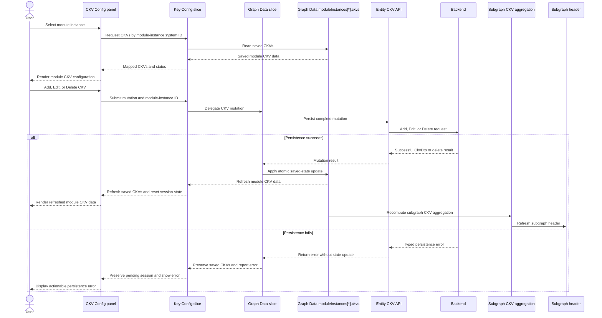

<!--
Copyright (c) Qualcomm Technologies, Inc. and/or its subsidiaries.
SPDX-License-Identifier: BSD-3-Clause
-->

# Calibration Key Vector Edit: Design

Requirements: [requirements.md](./requirements.md)

**Date:** 2026-09-18
**Status:** Draft for review

## 1. Scope and goals

This design covers CKV Add and Edit behavior for module instances in the Key
Configurator. It also covers duplicate prevention, module-wide PID support, and
independent vertically stacked panels when multiple modules are selected with
Ctrl+Click.

The implementation extends the existing CKV feature and configurator-panel
patterns. It adds the CKV persistence operations required by the existing
module-instance backend boundary, without changing Module Tag behavior or
graph/subgraph key-vector behavior.

## 2. Design decision

### 2.1 Decision

Make Graph Data the single saved-state owner for module-instance CKVs. Extend
the Graph Designer `key-config-slice` to select and coordinate those CKVs,
extend the Graph Data slice with persisted CKV mutations, and pass the slice
interface through the existing Key Configurator widget into the CKV panel.
Reuse `ConfiguratorPanel` for multi-module layout and add pure CKV identity
helpers.

This keeps the change within the existing Feature-Sliced Design boundaries:

- CKV UI remains in `features/key-configurator`.
- Saved module-instance CKVs remain in
  `features/graph-designer/model/graph-data-slice.ts`.
- Key Config selectors and mutation coordination live in
  `features/graph-designer/model/key-config-slice.ts`.
- Generic selected-item layout remains in `widgets/configurator-panel`.
- CKV comparison logic is pure feature logic and has no React or store
  dependency.

`calibration-keys-store.ts` and `module-instance-coordinator.ts` are removed
from the CKV read and write path. They must not maintain a second saved CKV
copy after this migration.

### 2.2 Data-flow overview



Module selection reads the existing `graphData.moduleInstances` entry; it does
not fetch a second module tuning configuration for CKVs. A successful mutation
updates that same Graph Data entry and refreshes the module CKV data before the
selected module panel and subgraph header consume the new saved state.

### 2.3 Alternatives considered

**Dedicated CKV session store:** Move every draft, selection, and validation
state into a new Zustand store. This would centralize the workflow, but would
duplicate the existing panel-local draft state and increase the migration
surface.

**Parent-owned batch state:** Lift every module's CKV draft into
`KeyConfiguratorPanel` and pass it to each child panel. This would make batch
coordination explicit, but would create prop coupling between the widget and
the feature UI.

**Key Configurator-owned CKV cache:** Keep normalized CKVs in the Key Config
slice and synchronize Graph Data after each mutation. This would make the
panel convenient, but would recreate the two-source inconsistency currently
seen between the module panel and subgraph header.

**Direct panel access to Graph Data:** Let the CKV panel read and mutate the
Graph Designer store directly. This minimizes prop plumbing, but creates a
same-layer feature dependency and makes the feature UI depend on Graph Data
implementation details.

The Graph Data ownership approach is preferred because it preserves one saved
state, keeps HTTP work below the store boundary, and lets the widget pass a
stable interface across the FSD feature boundary.

## 3. State ownership and data model

### 3.1 Module-instance identity

All module-scoped draft, status, and mutation state is addressed by a composite
module-instance key:

```text
moduleInstanceKey = moduleDefinitionId + ":" + instanceId
```

The numeric module definition ID alone is not sufficient because two instances
of the same definition can be selected at the same time. The module-instance
backend `systemId` is the identity used to read and persist the saved `ckvs` on
Graph Data. The composite key is used only for Key Config slice-local status
and draft coordination.

Graph Data stores saved CKVs directly on:

```text
graphData.moduleInstances[moduleInstanceSystemId].ckvs
```

The following Key Config slice state is keyed by `moduleInstanceKey` inside
`features/graph-designer/model/key-config-slice.ts`:

- module CKV load status;
- mutation status and user-visible errors;
- module-wide PID draft/status state while a panel is active.

The Key Config slice derives saved CKV entries from Graph Data and does not
store a second saved CKV array. This preserves module-instance isolation while
keeping the Graph Data entry authoritative for every consumer.

### 3.2 CKV identity

`ConfiguredCkv` will carry two identities where available:

- `backendSystemId`: the backend CKV ID, preserved from `CkvDto.systemId`;
- `clientId`: a stable UI identity. Existing entries use the backend ID; new
  entries receive a client-generated UUID.

The client identity is not sent as a new backend field. Request mapping
projects only the fields already understood by the backend.

The summary and Edit/Delete callbacks use `clientId`, not an array index. This
prevents an edit or delete from targeting the wrong entry after another entry
is removed.

### 3.3 Module-wide PID state

PID support is represented by the `supportedParameters` on the module
instance's Graph Data CKVs and normalized into a module-wide draft for the
picker:

```text
moduleParametersDraftByInstance[moduleInstanceKey] = CkvParameter[]
```

The checked PID IDs in this draft apply to every CKV for that module instance.
When the user applies a CKV Add or Edit, the Graph Data mutation writes the
same PID set to every affected saved CKV and updates the Graph Data entry.

PID support is therefore deliberately excluded from duplicate comparison. Two
CKVs differ only by their key/value pairs; PID support is a property of the
module's CKV configuration and is persisted through the Graph Data mutation.

### 3.4 Key-config-slice contract

The slice will expose the CKV read and mutation interface required by the
panel. It will replace the CKV responsibilities currently spread between
`calibration-keys-store` and `module-instance-coordinator`:

- available calibration keys, including their available values;
- derived saved CKVs from Graph Data by module-instance system ID;
- module-wide PID draft parameters by module-instance key;
- CKV loading/error status;
- module-instance selection initialization from Graph Data;
- Add/Edit/Delete delegation to Graph Data slice actions;
- reset/clear actions for project or tab cleanup.

The following attributes and contracts will be added to `KeyConfigSlice`. The
names are intentionally explicit so callers can distinguish project-wide key
definitions, module-instance saved state, and per-operation status:

**Existing attribute to extend:** The implementation shall update the existing
`calibrationKeys: CalibrationKey[]` attribute in
`features/graph-designer/model/key-config-slice.ts`. Saved CKVs shall remain on
Graph Data and shall not be copied into a second
`configuredCkvsByModuleInstance` state field.

```ts
type ModuleInstanceKey = string;

interface ModuleCkvContext {
  instanceId: number;
  moduleDefinitionId: number;
  moduleInstanceSystemId: string;
  projectId: string;
}

interface CkvMutationInput {
  instanceId: number;
  keyValuePairs: ConfiguredCkv['keyValuePairs'];
  moduleDefinitionId: number;
  moduleInstanceSystemId: string;
  pidConfig: number[];
  targetClientId?: string;
}

type CkvMutationResult =
  | {clientId: string; success: true}
  | {
      message: string;
      reason: 'duplicate' | 'invalid' | 'not-found' | 'not-ready';
      success: false;
    };
```

The slice state will contain these fields:

| Attribute                         | Shape                                                      | Ownership and purpose                                                                                                                                      |
| --------------------------------- | ---------------------------------------------------------- | ---------------------------------------------------------------------------------------------------------------------------------------------------------- |
| `calibrationKeys`                 | `CalibrationKey[]`                                         | Project-level calibration keys and their available values used by every CKV panel. This existing slice attribute remains the public source for the picker. |
| `getModuleInstanceCkvs`           | Selector derived from Graph Data                           | Saved CKVs for a module instance, mapped for the CKV panel without duplicating the saved array.                                                            |
| `moduleParametersDraftByInstance` | `Record<ModuleInstanceKey, CkvParameter[]>`                | The module-wide PID draft while the panel is active. The checked PID set applies to every CKV in that module instance.                                     |
| `ckvLoadStateByInstance`          | `Record<ModuleInstanceKey, SliceStatus>`                   | Loading/ready/error state for module-instance CKV data.                                                                                                    |
| `ckvMutationStateByInstance`      | `Record<ModuleInstanceKey, 'idle' \| 'saving' \| 'error'>` | Prevents duplicate in-flight mutations and lets the panel show saving/error feedback.                                                                      |
| `ckvErrorByInstance`              | `Record<ModuleInstanceKey, string \| null>`                | Last user-visible initialization or mutation error for the module instance.                                                                                |

The slice actions will be:

```ts
interface KeyConfigSliceCkvActions {
  addOrUpdateCkv: (input: CkvMutationInput) => Promise<CkvMutationResult>;
  clearModuleInstanceCkvState: (moduleInstanceKey: ModuleInstanceKey) => void;
  deleteCkv: (
    moduleDefinitionId: number,
    instanceId: number,
    clientId: string,
    moduleInstanceSystemId: string,
  ) => Promise<CkvMutationResult>;
  initializeModuleCkv: (context: ModuleCkvContext) => boolean;
  getModuleInstanceCkvs: (moduleInstanceSystemId: string) => ConfiguredCkv[];
  setModuleInstanceCkvError: (
    moduleInstanceKey: ModuleInstanceKey,
    message: string | null,
  ) => void;
  updateModuleCkvParameters: (
    moduleDefinitionId: number,
    instanceId: number,
    parameters: CkvParameter[],
  ) => void;
}
```

The existing `calibrationKeys: CalibrationKey[]` field will be extended or
normalized so each `CalibrationKey` contains the key identity and its available
values. The picker-facing shape is equivalent to:

```ts
interface CalibrationKey {
  keyId: number;
  keyName: string;
  values: Array<{
    name: string;
    valueId: number;
  }>;
}
```

The backend mapping may retain system IDs and metadata alongside these fields;
the important invariant is that the values needed by the CKV picker are owned
by `key-config-slice.calibrationKeys`, while saved CKVs remain owned by Graph
Data.

`ConfiguredCkv` will use `clientId` for UI identity, retain
`backendSystemId` when it came from the backend, and retain `pidConfig` as the
normalized PID projection needed by the existing DTO/request mapping. The
source of truth for the current PID selection is
`moduleParametersDraftByInstance`; a successful mutation writes the same sorted
PID array into every affected Graph Data CKV entry for that module instance.

Draft-only attributes such as `editingIndex` replacement (`targetClientId`),
selected key/value checkboxes, search text, expanded keys, sort order, and
inline draft errors remain in `CalibrationKeysConfigPanel`. They are not added
to `KeyConfigSlice`, because uncommitted state must be isolated to the mounted
module panel and discarded when that panel is cancelled or deselected.

The `ModuleInstanceKey` is created by one helper and used consistently by every
slice action. No action may construct a key from `moduleDefinitionId` alone.

`createKeyConfigSlice` will receive both `set` and `get`, plus the owning
project ID where required by the existing Graph Designer store factory. Its
parent state type will include `graphData` and the Graph Data CKV mutation
actions. The slice's module initialization context will carry the module
definition ID, module instance ID, and module-instance system ID. This
prevents one selected module from overwriting another module's status.

The `KeyConfiguratorPanel` widget will select the Key Config slice interface
from the Graph Designer store and pass it through
`ModuleConfigurationPanel` to `CalibrationKeysConfigPanel`. This keeps the
feature UI from importing the Graph Designer feature directly. The CKV panel
will not call `useCalibrationKeysStore` or read `graphData` directly.

The module-instance coordinator will be removed from the CKV initialization
path. It may remain for unrelated Module Tag loading until that path is
migrated separately, but it must not fetch or write a second CKV copy.

### 3.5 Canonical duplicate identity

The pure helper in `features/key-configurator/lib/ckv-identity.ts` will:

1. map each pair to `keyId:valueId`;
2. sort the pair signatures numerically or lexically by ID;
3. join them into one canonical string;
4. compare canonical strings without considering selection order.

The helper does not include PID IDs, labels, array position, or backend/client
identity. This means reordered pairs and different display labels do not create
false non-duplicates.

### 3.6 Graph Data and API contract

`graphData.moduleInstances` is keyed by module-instance system ID and already
contains the `CkvDto[]` used by `aggregateSubgraphCkvKeys`. The Graph Data
slice will add mutation actions that operate on that same entry:

```ts
interface GraphDataCkvActions {
  addModuleInstanceCkv: (
    moduleInstanceSystemId: string,
    input: CkvMutationRequest,
  ) => Promise<ApiResult<CkvDto>>;
  deleteModuleInstanceCkv: (
    moduleInstanceSystemId: string,
    ckvSystemId: string,
  ) => Promise<ApiResult<void>>;
  updateModuleInstanceCkv: (
    moduleInstanceSystemId: string,
    ckvSystemId: string,
    input: CkvMutationRequest,
  ) => Promise<ApiResult<CkvDto>>;
}
```

The entity API uses the shared `ApiResult<T>` response envelope. The request
contains the normalized CKV values needed by the backend; the exact transport
field names are defined by the existing entity DTO contract:

```ts
interface CkvMutationRequest {
  keyValueCollection: Array<{keyId: number; valueId: number}>;
  supportedParameterIds: number[];
}

interface ApiResult<T> {
  data?: T;
  errors?: string[];
  message: string;
  success: boolean;
  warnings?: string[];
}
```

The implementation may use the repository's existing shared `ApiResult` type
and map `CkvMutationRequest` to the backend request DTO when its endpoint
contract is finalized.

The raw HTTP functions and request/response DTOs belong in the entity
Key-Configurator API layer. The Graph Data slice owns orchestration and the
atomic in-memory update, not URL construction. The backend response is the
canonical source for the updated `CkvDto`; the slice does not invent backend
system IDs for saved entries.

For Add and Edit, the Graph Data action performs validation and backend
persistence before replacing the module instance's `ckvs` array. For Delete,
it removes only the targeted backend CKV identity after the backend succeeds.
No mutation updates Graph Data optimistically. This ensures a failed request
cannot make the subgraph header disagree with the backend.

The mutation request maps the panel's normalized key/value pairs and sorted
PID selection to the backend's existing CKV request shape. If the backend
requires a new endpoint or DTO for CKV definition mutations, that API contract
is added under `entities/key-configurator`; it is not embedded in a Zustand
slice.

## 4. Store operations

`key-config-slice.ts` will expose asynchronous Add/Edit/Delete operations whose
inputs identify the module instance by system ID, optional target `clientId`,
pending PID parameters, and pending key/value pairs. The slice performs local
validation and duplicate checks, then delegates persistence to the Graph Data
slice. Its result distinguishes success from validation, duplicate,
missing-target, backend, and loading-state failure.

The mutation algorithm is:

1. Build `moduleInstanceKey` for local status and read the module instance
   `ckvs` from Graph Data using `moduleInstanceSystemId`.
2. Reject the input if the module-instance state is not ready, no PID is
   selected, or no key/value pair is selected.
3. For Edit, find `targetClientId` and exclude only that entry from duplicate
   comparison. For Add, compare against every entry.
4. Compute the canonical key/value signature and reject an exact match.
5. Build the complete next module-instance CKV value for the Graph Data
   mutation. Add appends one entry; Edit replaces one entry at the same logical
   position; Delete removes only the target identity.
6. Delegate the mutation to the Graph Data slice, which calls the entity API.
7. On backend success, replace `graphData.moduleInstances[systemId].ckvs`
   atomically with the backend-confirmed result and clear the Key Config error
   and mutation status.
8. On failure, leave Graph Data unchanged and return the typed error to the
   panel.

Every validation or backend failure leaves the saved Graph Data CKVs unchanged.
The Graph Data mutation does not use an optimistic update or a remove-then-add
sequence visible to subscribers.

### 4.1 Add

The Key Config slice validates the pending key/value set against every existing
Graph Data CKV for the same module instance. If an exact match exists, it
returns a duplicate error and does not call the Graph Data mutation.

Otherwise it sends an Add request through Graph Data and applies the pending
PID set to all CKVs for that module instance in the backend-confirmed result.

### 4.2 Edit

The Key Config slice locates the target by `clientId` and excludes that entry from the
duplicate comparison. It then validates the pending key/value set against all
other entries.

- An unchanged Edit succeeds and preserves the target identity.
- An Edit that matches another entry returns a duplicate error with no state
  mutation.
- A valid changed Edit replaces only the target's key/value pairs.
- The pending PID set is applied to all entries in the module instance by the
  Graph Data mutation.

The Graph Data mutation builds the complete backend request before committing
the backend-confirmed module-instance `ckvs` with one Zustand update. There is
no remove-then-add sequence visible to subscribers, which prevents partially
applied edits.

### 4.3 Delete

Delete resolves `clientId` to the backend CKV system ID and delegates deletion
to Graph Data. The `Zero` display state is derived when the saved list is empty
and is never passed to the backend as a deletable CKV identity.

### 4.4 Validation result

The store/UI validation contract is:

- at least one PID must be checked;
- at least one key/value pair must be selected;
- duplicate key/value identity is rejected within the same module instance.

Validation errors remain in the active panel draft. Successful mutation is the
only path that closes Add/Edit mode and clears draft state.

## 5. CKV panel behavior

### 5.1 Existing panel changes

`CalibrationKeysConfigPanel` remains the owner of transient editor state:

- Add/Edit mode;
- active CKV `clientId`;
- pending key/value selections;
- pending module-wide PID selections;
- search, sort, and expansion state;
- inline validation/mutation error.

The panel receives saved entries, available calibration keys, module-instance
PID state, loading status, and typed mutation callbacks from
`KeyConfiguratorPanel`. The widget obtains those values from the Graph
Designer Key Config slice. The panel does not read Graph Data directly and
does not write saved state while the user is selecting keys or values.

The current index-based Edit/Delete callbacks are replaced with `clientId`
callbacks. The existing pre-population behavior is retained: selected values
are checked, their keys are expanded, and selected keys are partitioned before
unselected keys.

### 5.2 PID section

The existing `CkvParametersSection` remains visually and behaviorally the PID
editor. Its changes are draft-only until Apply. The section label and helper
text make the module-wide scope explicit: the checked PIDs apply to all CKVs
for the module.

When the panel opens an Edit session, it initializes the PID controls from the
module-wide PID state derived by the Key Config slice, not from an individual
CKV's key/value pairs.

### 5.3 Key/value picker

The existing search, sorting, expansion, Select All, and selected-first
behavior remain in the picker. Key/value changes affect only the active CKV
draft.

Unchecking a key immediately removes its pending values. Reselecting that key
does not restore the old values; it starts unselected and requires an explicit
value selection.

### 5.4 Apply and Cancel

The picker primary action calls the Key Config slice mutation and handles its
typed asynchronous result:

- success: close the session, clear draft state, and scroll to the saved CKV
  summary;
- duplicate: keep the session open and show the duplicate error near Apply;
- validation: keep the session open and show the affected validation error;
- backend or unexpected persistence failure: keep the last Graph Data state and
  show a recoverable error.

Cancel clears only transient panel state. It does not call a store mutation.
The existing confirmation pattern is used when the draft contains changes.

Delete calls the Key Config slice immediately without confirmation. The user
remains on the current Graph Data state if deletion fails.

## 6. Multiple-module selection and vertical layout

### 6.1 Stable configuration item key

`widgets/configurator-panel` will add a local helper that derives a stable key
from the discriminated item type:

- module: `module:<systemId>:<instanceId>`;
- subgraph: `subgraph:<systemId>`;
- subsystem: `subsystem:<systemId>`.

`ConfigurationSection`, React `key` values, expansion state, and removal
callbacks use this identity. Numeric `id` remains available for existing
display and lookup behavior but is not used as the unique identity for module
sections.

### 6.2 Ctrl+Click flow

The existing selection utility continues to treat Ctrl+Click as a toggle:

- clicking without Ctrl replaces the selected-items array;
- Ctrl+Click adds an unselected module;
- Ctrl+Click on an already selected module removes only that module.

The selection store preserves insertion order. `ConfiguratorPanel` maps that
order directly to vertically stacked sections, so the first selected module is
rendered first.

### 6.3 Panel isolation

Each module section renders a `ModuleConfigurationPanel` with its own
`moduleId` and `instanceId`. React keys use the stable module-instance key, so
adding or removing another module does not reuse a draft component for the
wrong module.

When a module is deselected, its section unmounts. Its uncommitted local draft
is discarded; saved store state remains unchanged.

Section expansion state is reconciled by stable key rather than resetting all
sections whenever the selected-items array changes.

## 7. File-level changes

Expected implementation files:

| Area               | File                                                                                    | Change                                                                                               |
| ------------------ | --------------------------------------------------------------------------------------- | ---------------------------------------------------------------------------------------------------- |
| CKV identity       | `packages/react-app/src/features/key-configurator/lib/ckv-identity.ts`                  | Add pure canonical signature, duplicate comparison, and module-instance key helpers.                 |
| CKV types          | `.../module-configurator-view/ui/calibration-keys/calibration-keys-config.types.ts`     | Add client/backend identity fields and typed mutation results.                                       |
| CKV slice          | `packages/react-app/src/features/graph-designer/model/key-config-slice.ts`              | Derive module CKVs from Graph Data, own panel status/drafts, and delegate Add/Edit/Delete mutations. |
| Graph Data slice   | `packages/react-app/src/features/graph-designer/model/graph-data-slice.ts`              | Add backend-backed module-instance CKV mutations and atomically update `graphData.moduleInstances`.  |
| CKV API            | `packages/react-app/src/entities/key-configurator/api/module-instance-ckv-api.ts`       | Add typed backend API functions for module-instance CKV Add/Edit/Delete.                             |
| CKV mapper         | `.../module-configurator-view/ui/calibration-keys/ckv.mapper.ts`                        | Map Graph Data `CkvDto` values to the panel model and map mutation requests back to DTOs.            |
| CKV panel          | `.../module-configurator-view/ui/calibration-keys/calibration-keys-config-panel.tsx`    | Use stable CKV IDs, typed results, module-wide PID drafts, and inline errors.                        |
| PID section        | `.../module-configurator-view/ui/calibration-keys/ckv-parameters-section.tsx`           | Clarify module-wide PID scope if needed by the final QUI copy.                                       |
| Summary            | `packages/react-app/src/features/key-configurator/config-summary-view.tsx`              | Support stable string or numeric item IDs and route Edit/Delete by identity.                         |
| Vertical sections  | `packages/react-app/src/widgets/configurator-panel/ui/configurator-panel.tsx`           | Use composite item identity and preserve section state while selection changes.                      |
| Widget integration | `packages/react-app/src/widgets/key-configurator-panel/ui/key-configurator-panel.tsx`   | Pass Graph Data-backed CKV selectors and mutation callbacks into each module panel.                  |
| Slice hook         | `packages/react-app/src/features/graph-designer/hooks/use-key-configurator.ts`          | Expose the Key Config slice interface to the widget integration boundary.                            |
| Coordinator        | `packages/react-app/src/features/key-configurator/model/module-instance-coordinator.ts` | Remove CKV fetching/distribution; retain only unrelated migration work if still required.            |
| Legacy CKV store   | `packages/react-app/src/features/key-configurator/model/calibration-keys-store.ts`      | Remove CKV consumers and saved CKV state after the Graph Data migration.                             |
| Public exports     | Relevant `index.ts` files                                                               | Export only helpers/types needed by consumers and tests.                                             |
| Unit tests         | `packages/react-app/tests/features/key-configurator/...`                                | Cover CKV helpers, store mutations, panel flows, and multi-instance behavior.                        |
| Widget tests       | `packages/react-app/tests/widgets/configurator-panel/...`                               | Cover stable identity, Ctrl+Click selection, vertical order, and deselection.                        |

The exact file split may be adjusted during implementation if an existing
public API can be extended without introducing a second abstraction.

## 8. Error handling and logging

User-correctable errors are rendered inline and do not use browser `alert`.
The logger records failed Key Config and Graph Data CKV actions with the
module-instance system ID and operation name, but tests mock
`~shared/lib/logger` as required by the project test conventions.

The Key Config slice never delegates a mutation before duplicate and validation
checks complete. Graph Data is updated only after the backend confirms the
mutation. If a slice/backend operation fails, the previous saved Graph Data
CKV list and PID state remain intact. Draft state remains available for retry.

## 9. Testing strategy

### 9.1 Pure helper tests

- Pair order does not affect a canonical signature.
- Different key/value sets are not duplicates.
- PID differences do not affect duplicate identity.
- Module definition ID plus instance ID produces distinct module keys.

### 9.2 Store tests

- Module selection derives the panel CKVs from the matching Graph Data module
  instance.
- Add delegates to Graph Data and does not mutate Graph Data before backend
  success.
- Add rejects an exact duplicate without changing Graph Data references or
  length.
- Edit excludes its target from duplicate comparison.
- Unchanged Edit succeeds with the same client/backend identity.
- Edit rejects a match with another CKV without partial removal.
- Valid Edit changes only the target key/value pairs and broadcasts PIDs
  through the Graph Data mutation.
- Delete removes only the requested Graph Data identity after backend success.
- Backend failure leaves Graph Data CKVs and PID state unchanged.

### 9.3 Graph Data and header tests

- Graph Data Add, Edit, and Delete call the correct entity API operation.
- Successful API responses replace only the targeted module instance's `ckvs`.
- Failed API responses preserve the previous module instance `ckvs`.
- Updating a module instance's `ckvs` causes subgraph aggregation to recompute.
- The subgraph header reflects the same CKV set shown by the module panel
  without a full graph reload.

### 9.4 Panel tests

- Existing CKV values and keys are restored in Edit.
- PID controls initialize from module-wide state.
- Key/value edits remain draft-only until Apply.
- Duplicate errors remain visible and preserve selections.
- Apply success closes the editor and refreshes the summary.
- Cancel discards pending key/value and PID changes.
- Unchecking and reselecting a key starts with no old values selected.

### 9.5 Vertical selection tests

- Ctrl+Click adds a second module without removing the first.
- Sections render in selection order.
- Two instances sharing a module definition ID receive distinct React and
  state identities.
- Removing one selected module leaves the other section and draft intact.
- Removing a module discards only that module's uncommitted draft.

## 10. Requirements alignment

| Requirements  | Design coverage                                                                                                                            |
| ------------- | ------------------------------------------------------------------------------------------------------------------------------------------ |
| FR-CKV-01–08  | Module-instance state, summary operations, Zero protection, and Delete flow in Sections 3–5.                                               |
| FR-CKV-09–16  | Edit identity, pre-population, PID draft, and key/value picker behavior in Sections 3 and 5.                                               |
| FR-CKV-17–24  | PID/key/value sections and picker behavior in Section 5.                                                                                   |
| FR-CKV-25–33  | Atomic Add/Edit, validation, duplicate handling, Cancel, and error results in Sections 4 and 5.                                            |
| FR-CKV-34–39  | Stable item identity, Ctrl+Click, vertical ordering, isolation, and deselection in Section 6.                                              |
| FR-CKV-40–45  | Graph Data ownership, Key Config access, backend persistence, failed mutation preservation, and header refresh in Sections 3, 4, and 8.    |
| I1–I8         | Composite ownership, atomic mutations, Zero handling, identity-preserving Edit, duplicate comparison, and panel isolation in Sections 3–6. |
| I9–I11        | Single Graph Data ownership, mutation propagation, and failure preservation in Sections 3, 4, and 8.                                       |
| NFR-CKV-01–04 | Existing responsive controls, keyboard-named actions, inline errors, and draft ownership in Sections 5 and 8.                              |
