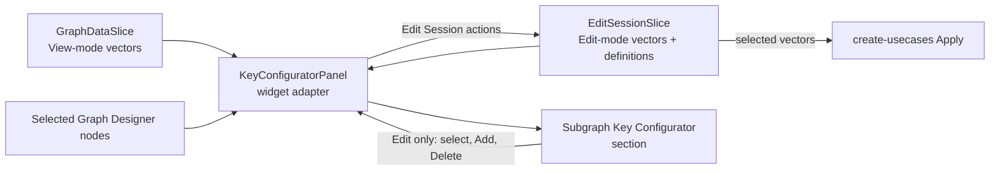

# Subgraph Key Configurator: Low-Level Design

**Requirements:** [requirements.md](requirements.md)

## 1. Scope

**1.1 Feature boundary.** The Subgraph Key Configurator provides store-backed
display and editing of the KV vectors associated with graph subgraphs. It
integrates with the Key Configurator host, Graph Designer store, graph-key
definitions, project preferences, and create-usecases Apply flow.

The following remain outside this design:

1. backend implementation and direct backend writes for individual actions;
2. graph topology ownership and the external policy/data contracts used for
   usecase routing and EC classification;
3. changes to Graph Designer Apply, Discard, and graph-removal operations; and
4. changes to non-subgraph configurators and generic Key Configurator stacking
   or collapse behavior.

## 2. Architecture

### 2.1 Overview

**2.1.1 State ownership.** `GraphDataSlice` owns the read-only KV-vector
snapshot as part of each `Subgraph`. `EditSessionSlice`, composed into
`GraphDesignerStore`, owns the editable copy for an active edit session.



Read the diagram left to right:

1. **2.1.2** The adapter reads Graph Data in View mode or Edit Session in Edit
   mode.
2. **2.1.3** Graph Designer selection identifies which selected items require a
   Subgraph Key Configurator section.
3. **2.1.4** In Edit mode, panel changes return through the adapter and update
   Edit Session state.
4. **2.1.5** Apply serializes selected Edit Session vectors; it does not read
   the panel or Graph Data.

**2.1.6 Feature boundary.** The Key Configurator reads Graph Data in View mode
and the Edit Session copy in Edit mode. Its SGKV feature code resolves selected
and EC metadata from explicit inputs; it does not read Graph Designer state.
The always-mounted Graph Designer widget supplies those inputs and applies the
result, so metadata refresh does not depend on opening the Key Configurator.

### 2.2 FSD ownership

| Ref   | Area                                                   | Responsibility                                                                              |
| ----- | ------------------------------------------------------ | ------------------------------------------------------------------------------------------- |
| 2.2.1 | `entities/subgraph-definitions`                        | SGKV transport DTO and shared KV-vector types.                                              |
| 2.2.2 | `entities/key-definitions`                             | Shared key-definition DTO and API for every key type.                                       |
| 2.2.3 | `features/graph-designer/model`                        | Read-only vectors, editable session vectors, mutations, and Apply-facing state.             |
| 2.2.4 | `features/graph-designer/lib`                          | Pure vector mapping and local-ID signature helper.                                          |
| 2.2.5 | `features/key-configurator/subgraph-configurator-view` | Vector UI, filtering, formatting, Add interaction, and a state-free SGKV metadata resolver. |
| 2.2.6 | `widgets/graph-designer`                               | Runs the SGKV metadata lifecycle for selected canvas subgraphs.                             |
| 2.2.7 | `widgets/key-configurator-panel`                       | Adapts Graph Designer selection and SGKV actions to the configurator UI.                    |

**2.2.8 Feature import rule.** The Key Configurator feature shall not import
Graph Designer.

**2.2.9 Assigned-vector ownership.** Assigned KV-vector state is not owned by
a Key Configurator store. It is read from Graph Data in View mode and from Edit
Session in Edit mode.

## 3. Store design

**Files:**

- `packages/react-app/src/entities/subgraph-definitions/model/subgraph-kv.types.ts`
- `packages/react-app/src/features/graph-designer/model/edit-session-slice.ts`
- `packages/react-app/src/features/graph-designer/model/graph-data-slice.ts`

**3.0.1 Shared SGKV types.** Shared SGKV types are owned by the entity layer so
Graph Designer and Key Configurator can consume them without feature-to-feature
imports. `isSessionAdded` is meaningful only in Edit Session state.

```ts
interface KvSelection {
  isEc: boolean;
  isSessionAdded?: boolean;
  keyValuePairs: KeyValue[];
  selected: boolean;
  systemId: string;
}

interface KvSelectionMetadata {
  isEc: boolean;
  selected: boolean;
}
```

**3.0.2 Graph Data Slice.** `GraphDataSlice.Subgraph` owns the View-mode
vector snapshot. It updates derived View-mode metadata without changing vector
pairs or identity.

```ts
interface Subgraph {
  // other subgraph fields
  kvVectors: KvSelection[];
}

interface GraphDataSlice {
  updateSgKvMetadata: (
    metadataBySubgraphId: Record<string, Record<string, KvSelectionMetadata>>,
  ) => void;
}
```

**3.0.3 Edit Session Slice.** `EditSessionSlice` owns the editable vector map,
the Edit-only definition cache, and all user mutations.

```ts
interface EditSessionSlice {
  availableGraphKeys: KeyDefinitionResponseDto[] | null;
  kvSelectionsById: Record<string, KvSelection[]>;

  addSgKvVector: (
    subgraphSystemId: string,
    keyValuePairs: KeyValue[],
  ) => boolean;
  deleteSgKvVector: (subgraphSystemId: string, vectorSystemId: string) => void;
  updateSgKvConfigInfo: (
    vectorsBySubgraphId: Record<string, KvSelection[]>,
  ) => void;
  setSgKvVectorSelected: (
    subgraphSystemId: string,
    vectorSystemId: string,
    selected: boolean,
  ) => void;
}
```

**3.0.4 Available-definition contract.** `availableGraphKeys` retains the
existing `KeyDefinitionResponseDto` objects whose `isGraphKey` value is true,
in backend response order. The Add controls read their `naturalId`, `name`,
`systemId`, and values as read-only data.

### 3.1 State rules

**3.1.1** `EditSessionSlice.kvSelectionsById` is keyed by subgraph system ID,
matching `graphData.subgraphs` and Apply.

**3.1.2** Each array item is one complete KV vector.

**3.1.3** Each vector mapped from `SubgraphResponseDto.SGKV` retains its
`systemId` as `KvSelection.systemId`.

**3.1.4** A session-added vector receives a deterministic local ID derived from its
canonical pair signature and prefixed with `local:`.

**3.1.5** Session-added vector pairs follow graph-key definition order. Existing
vector pair order is preserved from the Graph Data snapshot.

**3.1.6** Vector equality is order-independent. It compares each
`keySystemId:valueSystemId` pair first, then falls back to its numeric
`keyId:valueId` pair when persisted vectors and graph-key definitions use
different system IDs for the same pair.

**3.1.7** `isEc` is metadata derived by the Key Configurator resolver and
applied by the Graph Designer lifecycle. Users cannot edit it, and Apply does
not send it.

**3.1.8** `isSessionAdded` exists only on the edit-session copy and is not sent by
Apply.

**3.1.9** `availableGraphKeys` is populated only for an active Edit session.

**3.1.10** Components shall use store actions rather than raw Zustand `setState`.

### 3.2 Actions

**Graph Data Slice**

| Ref   | Action                     | Effect                                                                                                                                       |
| ----- | -------------------------- | -------------------------------------------------------------------------------------------------------------------------------------------- |
| 3.2.1 | Update Graph Data metadata | Replaces only `selected` and `isEc` for matching Graph Data vectors. It ignores unknown subgraphs/vectors and does not mark the graph dirty. |

**Edit Session Slice**

| Ref   | Action                  | Effect                                                                                                                                                                                                                                                                                                                                                                                                               |
| ----- | ----------------------- | -------------------------------------------------------------------------------------------------------------------------------------------------------------------------------------------------------------------------------------------------------------------------------------------------------------------------------------------------------------------------------------------------------------------- |
| 3.2.2 | Update SGKV config info | Receives a complete vector map from Graph Data reconciliation or Edit-mode metadata calculation. It adds missing active subgraph entries with `isSessionAdded: false`, removes inactive subgraph entries, preserves session-only vectors, and applies incoming `selected`/`isEc` metadata to vectors with matching system IDs. It does not mark the graph dirty or write state when the reconciled map is unchanged. |
| 3.2.3 | Select/unselect         | Updates only one vector's `selected` field and marks the graph dirty when its value changes.                                                                                                                                                                                                                                                                                                                         |
| 3.2.4 | Add                     | Rejects incomplete or duplicate vectors, creates a local ID, inserts a selected session-added vector with `isEc: false`, marks the graph dirty, and returns whether it accepted the candidate. A later completed Graph Data refresh recalculates EC classification.                                                                                                                                                  |
| 3.2.5 | Delete                  | Removes only a vector whose stored `isSessionAdded` value is true and marks the graph dirty.                                                                                                                                                                                                                                                                                                                         |

**3.2.6 Dirty-state boundary.** `GraphDataSlice.isDirty` signals that an
accepted user change is pending Apply or Discard. It is unrelated to loading
graph-key definitions: `enterEditMode` does not mark the graph dirty when it
populates `availableGraphKeys`.

**3.2.7 Mutation boundary.** Mutation actions validate the target subgraph and
vector inside the store. UI visibility is not treated as an authorization
boundary.

## 4. Data population and lifecycle

### 4.1 SGKV transport mapping

**File:**
`packages/react-app/src/entities/subgraph-definitions/model/subgraph-response.dto.ts`

**4.1.1 Transport contract.** The API mapper shall represent the Swagger
`SubgraphResponseDto.SGKV` contract as a list of vectors:

```ts
interface KeyValuePairDto {
  key: {
    keyId: number;
    name: string;
    systemId: string;
  };
  value: {
    name: string;
    systemId: string;
    valueId: number;
  };
}

interface SubgraphKvVectorDto {
  keyValuePairs: KeyValuePairDto[];
  systemId: string;
}

interface SubgraphResponseDto {
  // scalar fields
  SGKV: SubgraphKvVectorDto[];
}
```

### 4.2 Graph-data population

**Files:**

- `packages/react-app/src/entities/usecases/api/usecases-api.ts`
- `packages/react-app/src/features/graph-designer/model/graph-data-slice.ts`
- `packages/react-app/src/features/graph-designer/lib/subgraph-kv-mapping.ts`

**4.2.1 Full graph load.** On every full graph load, `loadGraphData` calls
`getSubgraphsByIds` for all active subgraphs. The response includes SGKV
data. The mapper converts each response vector into `KvSelection`, and the
Graph Data slice replaces each matching `Subgraph.kvVectors` alongside the
subgraph name and type.

**4.2.2 Selection-time behavior.** Selecting a subgraph shall not issue
another SGKV request. A usecase change or successful Apply/Discard reload
replaces the read-only graph snapshot with the new backend response.

**4.2.3 Edit-mode reconciliation.** When `ProjectStore.editModeState` is
`edit`, a completed `GraphDataSlice.loadGraphData` derives
`Record<subgraphSystemId, KvSelection[]>` from the refreshed Graph Data
snapshot and passes it to `EditSessionSlice.updateSgKvConfigInfo()`. The action
does not replace the editable map: for every surviving subgraph, it preserves
the current Edit Session vectors, including session-added vectors, and refreshes
`selected` and `isEc` for vectors with matching backend system IDs. It
initializes a subgraph newly present in the graph and removes Edit Session state
only for a subgraph no longer present. In View mode, it does not update Edit
Session state.

For example, if Edit Session contains `SG1` with a session-added `local:`
vector and selecting another usecase refreshes Graph Data, reconciliation keeps
that local vector as long as `SG1` remains in the refreshed graph.

**4.2.4 Recompute handoff.** `recomputeContainersAndSubgraphs` preserves
`kvVectors` for surviving subgraphs and follows the same mapping path for newly
derived subgraphs before replacing the Graph Data snapshot. If an Edit session
is active, it then passes the complete resulting vector map to
`updateSgKvConfigInfo()`.

**4.2.5 Empty-graph handoff.** `initializeEmptyGraphData` replaces Graph Data
with an empty snapshot. If an Edit session is active, it passes an empty vector
map to `updateSgKvConfigInfo()`.

### 4.3 Edit entry

**4.3.1 Entry sequence.**
`packages/react-app/src/features/graph-designer/model/edit-session-slice.ts`
performs these steps in order:

1. acquire the Graph Designer exclusive-mode lock;
2. end the active project session and start a Designer session;
3. load graph-key definitions, treating failure as non-fatal;
4. call `updateSgKvConfigInfo()` with all
   `graphData.subgraphs[*].kvVectors`, preserving `systemId`, `keyValuePairs`,
   `selected`, and `isEc`, while setting `isSessionAdded` to `false`; and
5. set Edit Session mode and `ProjectStore.editModeState` to `edit`.

If session transition fails, the method releases the exclusive-mode lock and
does not modify SGKV state or enter Edit mode.

**4.3.2 Edit source.** The Key Configurator reads this editable copy for the
remainder of Edit mode.

**4.3.3 Refresh reconciliation.** The Edit-mode refresh behavior is defined in
**4.2.3**. It preserves existing vector pairs and `isSessionAdded` state; the
metadata calculation for the completed Graph Data snapshot then replaces
`selected` and `isEc`.

### 4.4 Apply, Discard, and Edit exit

**4.4.1 Apply, Discard, and exit.** Apply and Discard submit or discard
edit-session state, reload Graph Data, and only then exit Edit mode. The reload
refreshes `Subgraph.kvVectors` from the backend. `exitEditMode` clears the
editable map and `availableGraphKeys`; it does not copy data back to Graph
Data. If reload fails, Edit mode remains active with its session state.

### 4.5 Graph-key definitions

**Files:**

- `packages/react-app/src/entities/key-definitions/api/key-definition-api.ts`
- `packages/react-app/src/features/graph-designer/model/edit-session-slice.ts`

**4.5.1 Definition load.** During Edit entry, `getAllKeyDefinitions(projectId)`
loads project definitions. `EditSessionSlice` retains only definitions whose
`isGraphKey` value is true, in response order.

```text
EditSessionSlice.enterEditMode
  └─ getAllKeyDefinitions(projectId)
       └─ EditSessionSlice.availableGraphKeys
```

A definition-load failure leaves `availableGraphKeys` as `null`; a successful
response with no graph-key definitions leaves it empty. Neither state prevents
Edit mode. Opening Add shows an unavailable-definitions message instead of the
Editor and Selection Panel.

**4.5.2 Definition consumer.** `SubgraphKeyVectorConfigPanel` receives
`availableGraphKeys` through the widget adapter for the Add controls.

### 4.6 Apply and View mode

**4.6.1** View mode reads
`GraphDataSlice.graphData.subgraphs[*].kvVectors`.

**4.6.2** Apply reads `EditSessionSlice.kvSelectionsById`.

**4.6.3** `buildCreateUsecasesRequest` sends only selected vectors and their value
system IDs.

**4.6.4** Leaving Edit mode clears only the editable vector map.

**4.6.5** Closing the project destroys its Graph Designer tab store.

## 5. UI design

### 5.1 Mode and data source

**5.1.1 Mode switch.** `KeyConfiguratorPanel` reads
`ProjectStore.editModeState` to select the subgraph-vector source:

| Ref   | Project mode | Vector source                                                    | Mutability |
| ----- | ------------ | ---------------------------------------------------------------- | ---------- |
| 5.1.2 | View         | `GraphDataSlice.graphData.subgraphs[subgraphSystemId].kvVectors` | Read-only  |
| 5.1.3 | Edit         | `EditSessionSlice.kvSelectionsById[subgraphSystemId]`            | Editable   |

**5.1.4 Widget adapter.** The widget reads Graph Designer state and passes
vectors plus mutation callbacks to the feature panel. On Add, Delete, or
selection change, its callback invokes the corresponding Edit Session action.
The feature panel does not import Graph Designer or Project Store code.

### 5.2 Selection integration

**5.2.1 Selection mapping.** Graph Designer owns selection.
`KeyConfiguratorPanel` maps selected `SUBGRAPH` and `SUBGRAPH_PROXY` nodes into
the Key Configurator `ConfigurationItem` contract.

**5.2.2 Host composition.** `ConfiguratorPanel` renders stacked, independently
collapsible sections. The Subgraph Key Configurator supplies the content for
subgraph sections.

### 5.3 Subgraph panel contract

**5.3.1 Panel contract.** `SubgraphKeyVectorConfigPanel` receives canonical
vector state and mutation callbacks from the widget:

```ts
interface SubgraphKvFilterState {
  ec: boolean;
  regular: boolean;
  searchText: string;
  selected: boolean;
  unselected: boolean;
}

interface SubgraphKeyVectorConfigPanelProps {
  displayMode: 'key-value' | 'value-only';
  filters: SubgraphKvFilterState;
  isEditable: boolean;
  isMetadataPending?: boolean;
  availableGraphKeys: KeyDefinitionResponseDto[] | null;
  onAdd: (keyValuePairs: KeyValue[]) => boolean;
  onDelete: (vectorSystemId: string) => void;
  onFiltersChange: (filters: SubgraphKvFilterState) => void;
  onSelectionChange: (vectorSystemId: string, selected: boolean) => void;
  subgraphSystemId: string;
  vectors: KvSelection[];
}
```

**5.3.2 Shared filter state.** The widget creates one filter-state instance for
the Key Configurator session and passes it to every rendered subgraph panel. It
defaults to empty search, enabled `selected`, and enabled `regular`; it survives
subgraph selection and mode changes, and resets when the project session closes.

**5.3.3 Panel isolation.** The component does not import Graph Designer. Vector
data, mutations, shared filter state, and the Edit-session graph-key cache
remain controlled through props. Delete is shown only when `isEditable` and the
vector's `isSessionAdded` value are both true.

**5.3.4 Pending metadata.** When `isMetadataPending` is true, the panel shows
`Determining selected and EC status...` in place of the vector rows. This
prevents the current vector classification from appearing under a Selected or
Unselected filter before the selected-subgraph membership request completes.

### 5.4 Component structure

```text
SubgraphKeyVectorConfigPanel
├── Vector toolbar
│   ├── Search
│   ├── Add KV Vector (Edit mode only)
│   ├── Selected / Unselected selection filters
│   └── Regular / EC type filters
├── KV vector list
│   └── KV vector row
│       ├── Selection checkbox
│       ├── Formatted vector text
│       ├── Copy
│       └── Delete (session-added only)
└── Add KV Vector section (Edit mode only)
    ├── Add KV Vector Editor
    ├── Add KV Vector Selection Panel
    └── Add action row (complete candidate)
```

**5.4.1 Panel composition.** The Vector toolbar keeps the primary Add KV
Vector button beside Search. For a complete candidate, the Add section keeps
an action row with its primary filled Add button right-aligned. A duplicate
candidate disables that button and shows `This KV vector already exists.` on
the left of the same row using the semantic error text style.

**5.4.2 Control convention.** QUI controls are used where equivalents exist.
Delete uses a QUI confirmation dialog rather than `window.confirm`.

### 5.5 KV Vector List

**5.5.1 Canonical list.** The store-provided vector array is canonical; the
list never copies or sorts it in place. A pure `getVisibleKvVectors` helper
derives the visible projection:

1. **5.5.2** Split `searchText` on `+`, trim it, and discard empty terms.
2. **5.5.3** Match every term case-insensitively against a vector's complete
   `[Key:Value]` search representation, independently of display mode.
3. **5.5.4** Keep EC vectors when `ec` is enabled and regular vectors when
   `regular` is enabled. The two individual filters may be enabled
   simultaneously; when neither is enabled, there are no matches.
4. **5.5.5** Keep selected vectors when `selected` is enabled and unselected
   vectors when `unselected` is enabled. The two individual filters may be
   enabled simultaneously; when they are, stably place selected vectors before
   unselected vectors. When neither is enabled, there are no matches.

**5.5.6 Mutation scope.** The toolbar updates only shared browsing state. Row
selection, Add, and Delete update only the selected subgraph's vector store
entry. The filtered projection is recomputed whenever its vectors, metadata, or
filters change.

**5.5.7 Empty states.** The list distinguishes two empty states: no canonical
vectors uses the vector empty state; a non-empty canonical list with no
projection match uses a no-matches state.

**5.5.8 Row behavior.** Each compact row has a fixed leading selection
checkbox, single-line truncated vector text with a full-text tooltip, and
trailing icon actions. An EC vector has a mild purple row tint. Copy is always
present; Delete is present only in Edit mode for a session-added vector. The
list scrolls vertically and does not require horizontal scrolling.

### 5.6 Display and Copy

**5.6.1 Display representations.** The list uses distinct pure representations:

```text
Search:          [DeviceTX:A2B_Mic][StreamTX:PCM_ULL_Record]
Key Value row:   [DeviceTX:A2B_Mic][StreamTX:PCM_ULL_Record]
Value Only row:  A2B_Mic+PCM_ULL_Record
Copy:            follows the active row display format
```

**5.6.2 Preference mapping.** The list reuses the existing `Display Options`
→ `Usecase Name` preference: `Key Value(s)` selects Key Value mode; `Alias`
and `Value(s)` select Value Only mode. Preference changes reformat the visible
rows without changing stored vectors, filter results, or candidate selection. A
valid open Add-editor draft is also reformatted in the new mode.

**5.6.3 Copy behavior.** The panel writes the complete formatted vector through
`navigator.clipboard.writeText`. A clipboard failure is logged and leaves vector
and candidate state unchanged.

### 5.7 Read-only and Edit modes

**5.7.1 View mode.** View mode keeps search, filters, scrolling, and Copy
enabled. It disables row selection, hides the Add section and Delete actions,
and does not mutate state.

**5.7.2 Edit mode.** Edit mode enables selection changes and Add. Delete is
visible only when the stored vector has `isSessionAdded: true`; the store action
verifies eligibility again before deletion. Delete first opens a confirmation
dialog; dismissal makes no store change.

**5.7.3 Persistence boundary.** There is no configurator-level Apply action.
The Add section's local Cancel action only clears and hides its draft; it does
not alter stored vectors. Accepted selection, Add, and Delete operations update
the store immediately. Graph Designer Apply remains the persistence boundary.

## 6. Add KV Vector design

**6.0.1 Local draft boundary.** The Add section is local component state. It
constructs one candidate for one subgraph and never mutates the vector store
until Add succeeds. Ownership is intentionally split as follows:

| Owner                          | Local state                                                                                                                   |
| ------------------------------ | ----------------------------------------------------------------------------------------------------------------------------- |
| `SubgraphKeyVectorConfigPanel` | candidate pairs, editor text and diagnostic, selected keys and values, expanded keys, and Add-section visibility/eligibility. |
| generic `KvVectorEditor`       | suggestion-popup visibility and the active suggestion.                                                                        |

**6.0.2 Draft invariant.** `selectedKeySystemIds` and
`selectedValueSystemIdByKeySystemId` describe complete selected pairs: every
selected key has exactly one selected value and every value-map key is selected.
Invalid editor text clears this candidate selection while retaining the invalid
text and validation feedback.

**6.0.3 Draft identity.** Selected key IDs are unique, and every value-map key
must be a selected key. Suggestions carry key and value system IDs so duplicate
labels cannot create ambiguous stored state. In Value Only mode, an explicit
suggestion or Selection Panel choice retains those IDs while its displayed value
token is unchanged.

### 6.1 Add controls and Selection Panel

**6.1.1** The Add section is available only in Edit mode. When
`availableGraphKeys` contains one or more keys, opening it creates an empty
draft. When definitions are unavailable or empty, opening it shows an
unavailable-definitions message instead of a draft, and does not alter stored
vectors or an already-open draft.

**6.1.2** `AddKvVectorSelectionPanel` presents the available keys as a compact,
expandable tree. The Add KV Vector Editor is the sole definition search control;
the Selection Panel has no independent key/value filter. Expand All and Collapse
All sit in the Selection Panel's sticky header beside Key ID and Key Name. Those
headers sort keys and values by identifier or name without changing the
candidate.

**6.1.3** A key checkbox reflects whether one of its values is selected. An
unchecked checkbox is disabled; selecting a value checks its key. A checked
checkbox removes its selected value when cleared. A key permits one value
selection.

**6.1.4** Manual panel changes derive complete pairs from selected keys with values,
retaining selection order in the draft candidate. They replace `editorText` using
the active display mode and clear validation/suggestions. Add restores graph-key
definition order before storing the vector. A key without a value is not selected
in the panel and does not appear in editor text.

**6.1.5** The editor, suggestion popup, key list, and value lists wrap or scroll
vertically as needed and do not require horizontal scrolling for normal use.

### 6.2 Editor parsing, resolution, and formatting

**6.2.1 Completed-candidate formats.** A completed candidate is rendered in
one of two formats selected by the active display mode. While a candidate is
incomplete, the editor may accept a typed key or value fragment in either mode
and offer complete key/value-pair suggestions.

```text
Key Value:       [DeviceTX:A2B_Mic][StreamTX:PCM_ULL_Record]
Value Only:      A2B_Mic+PCM_ULL_Record
```

**6.2.2 Parser rules.** The parser identifies syntax and tokens while retaining
the offending token text for diagnostics. It treats spaces, tabs, and line
breaks as formatting whitespace when they occur around delimiters or between
complete entries. It does not delete whitespace inside a key or value name,
infer missing semantic delimiters, or correct spelling. Key Value syntax does
not choose an ambiguous definition. Whitespace-only text is a valid empty
candidate.

**6.2.3 Resolver rules.** `resolveKvVectorEditorInput` resolves parsed names
case-insensitively against `availableGraphKeys`. A Key Value pair must resolve
to that key and one of its values. For Value Only text, the resolver finds one
key for each value token. It cannot use a key twice. It tries keys in numeric
key-ID order, then system-ID order when IDs match. It backtracks when the first
choice prevents a later token from finding a key. If no complete result exists,
the candidate is invalid. A repeated value with a complete result is valid,
shows a warning, and keeps Add available. A suggestion or Selection Panel choice
stores the exact key/value IDs for that token. As long as the value text stays
the same, the resolver uses those IDs instead of choosing another matching key.
Unknown names, duplicate keys, empty tokens, and reused keys produce errors with
the relevant text and key context. A valid trailing `+` preserves the resolved
prefix for continued entry.

**6.2.4 Atomic resolution.** Resolution is atomic:

1. valid input replaces the selected key/value IDs and is formatted canonically
   in the active display mode; an automatically resolved Value Only assignment
   remains addable while its warning stays visible;
2. empty input clears selected keys and values; and
3. incomplete or invalid input stays visible, clears the candidate and Selection
   Panel selection, and disables Add.

**6.2.5 Diagnostic presentation.** An incomplete final expression produces a
neutral hint. When Value Only matching chooses between keys, it shows a
non-blocking warning that values are shared by multiple keys. The warning tells
the user to use Key Value mode or the Selection Panel to check or change the
keys. It does not list every matching key or value. A malformed, unknown,
duplicate, conflicting, or impossible entry produces an error. Errors quote the
relevant key, value, or input text instead of using pair/value numbers. Parser
and resolver code return diagnostic data; `kv-vector-editor-diagnostic.ts`
creates the text, and the SGKV editor adapter displays it. The native textarea
remains the editing surface; rich text and syntax colouring are out of scope.

**6.2.6 Display-mode transition.** Changing display mode reformats a valid
editor value without changing the candidate or its current pair order. When
Value Only syntax is unavailable because a definition name contains `+`, the
editor remains in Key Value syntax.

### 6.3 Suggestions and keyboard interaction

**6.3.1 Suggestion input.** `getKvVectorEditorSuggestions` receives editor
text, caret position, graph-key definitions, and display mode. It parses the
text internally. Each returned suggestion carries its exact replacement range
and replacement text.

**6.3.2** In Key Value syntax, every row represents one complete `[Key:Value]`
pair. A key position lists values of unused keys whose names match the typed
fragment; a value position lists values of the resolved key whose names match
that fragment. No row represents a key without a value. Suggestion
rows show the value as primary text and its `Key: <name>` context at the right
in subdued text. Value Only input suggests values only after a non-whitespace
prefix, shows their owning key, and excludes already-used keys. Leading and
trailing token whitespace is ignored.

**6.3.3** Suggestions are case-insensitive, sorted, capped at 50, and have no
initial active item. Their normal label order is retained. If two rows show the
same value, their keys are ordered by numeric key ID and then system ID. Formatting
line breaks are tolerated. A complete valid vector has no suggestions. The only
exception is a Value Only vector with an automatic-match warning: its suggestions
stay open so the user can choose a different key. An invalid earlier expression
has no suggestions.

**6.3.4** Up/Down moves an explicit active item without wrapping. Enter or a
pointer action commits only that item; Enter with no active item closes the
popup without changing text. Escape closes and consumes the key; Tab and editor
focus loss close the popup while preserving normal focus behavior.

**6.3.5** A Key Value key-position suggestion replaces its complete bracketed
pair range with `[Key:Value]`. A value-position suggestion replaces only its
value-token range and completes pair syntax when needed. A Value Only
suggestion committed at the end of Value Only text appends `+` for continued
entry. The resulting text is resolved through the same atomic editor path, but
an explicit Value Only suggestion keeps its key/value IDs instead of resolving
the same value text again. Its key is hidden from later Value Only suggestions
while that token is unchanged.

### 6.4 Add eligibility and outcome

**6.4.1 Add eligibility.** `getAddKvVectorEligibility` derives eligibility from
the local draft and the canonical vector list. Add is enabled only when the
editor is valid, at least one complete pair exists, every selected key has one
value, and no stored vector has the same complete set of pairs.

**6.4.2 Add outcome.** On Add, `SubgraphKeyVectorConfigPanel` passes resolved
pairs to its widget callback. The widget invokes `addSgKvVector`; the store
rechecks completeness and duplicate vectors, then inserts a selected session-added
vector and marks the graph dirty. The component clears and closes the Add
section only after that callback accepts the candidate. Rejection leaves the
draft open and unchanged. There is no local Apply action; local Cancel discards
and hides only the draft.

## 7. Selected and EC metadata synchronization

**7.1 Metadata trigger.** Each stored vector carries `selected` and `isEc`
metadata required by the UI. The Key Configurator feature owns the calculation.
The always-mounted Graph Designer synchronization hook invokes it for selected
subgraphs when the selection, completed Graph Data snapshot, or project mode
changes. In Edit mode, it reads the latest
`EditSessionSlice.kvSelectionsById` and
`EditSessionSlice.subgraphProvenanceById` through the project store without
subscribing to them. Therefore, user-originated selection, Add, and Delete
mutations do not trigger automatic recalculation.

**7.1.1 Metadata sources.** The feature's state-free resolver loads the
containing `UsecaseDto` records through
`getUsecasesWithFilter(projectId, "subgraphNaturalId:<naturalId>")`. The
filtered response supplies the matching usecases' type and GKV pairs needed
for both classifications. It does not load the complete catalog or query
usecase components. If the subgraph natural ID or response is unavailable, the
resolver returns no metadata; the Graph Designer hook leaves the current
metadata unchanged and shows a warning.

**7.1.2 Pending presentation.** `GraphDataSlice` stores one transient
`isSgKvMetadataRefreshing` flag alongside the View-mode metadata it already
owns. The Graph Designer lifecycle sets it before refreshing the current
selected-subgraph batch and clears it only when that batch completes. The Key
Configurator uses it to present a neutral `Loading...` message until metadata
arrives. A failed response keeps existing metadata and shows the warning
described above.

**7.2 Auto-selection.** Auto-selection processes each selected subgraph. In
Edit mode, a subgraph whose `subgraphProvenanceById` value is
`palette-placed` is excluded. For every remaining subgraph:

1. **7.2.1** Resolve the selected usecases that contain that subgraph.
2. **7.2.2** For each KV vector, mark it selected when its complete KV-pair set is a
   subset of at least one of those usecases' KV data for that same subgraph;
   otherwise mark it unselected.

Membership determines which usecases are considered; comparison uses each
containing usecase's `keyValueCollection` GKV data. For example, if selected
usecases `U1` and `U2` contain `SG1`, an `SG1` vector with pairs `A` and `B` is
selected when `U1` or `U2` contains both pairs. It is unselected when neither
containing usecase contains the complete pair set.

**7.3 Calculation helper.** `resolveSubgraphKvMetadata` is the state-free Key
Configurator boundary used by Graph Designer. It loads the sources in **7.1.1**
and passes them to the pure `calculateSubgraphKvMetadata` helper. The helper
receives selected usecase IDs from the completed Graph Data snapshot, the
target vector map, usecase GKV data with containing subgraph IDs, and Edit-mode
provenance when applicable. It returns:

```ts
Record<subgraphSystemId, Record<vectorSystemId, KvSelectionMetadata>>;
```

**7.4 Metadata write.** In View mode, the target map is Graph Data and the
Graph Designer hook dispatches `GraphDataSlice.updateSgKvMetadata`. In Edit
mode, the target map is the Edit Session map. The hook overlays the returned
metadata onto that complete map and dispatches
`EditSessionSlice.updateSgKvConfigInfo`. A completed Graph Data refresh is
authoritative: after reconciliation, the effect recalculates and replaces
`selected` and `isEc`, including staged Edit Session metadata. The update is
idempotent and does not write when metadata is unchanged.

**7.5 Widget boundary.** The Graph Designer widget owns lifecycle timing and
write targets. The Key Configurator feature owns SGKV-specific source loading
and calculation, receives explicit inputs, and does not import Graph Designer
state.

## 8. Error and concurrency handling

**8.1** A Graph Data request is authoritative only after it commits a complete
snapshot and reaches its ready state. Metadata synchronization observes that
committed snapshot, never an in-progress request. Source loading is asynchronous;
the calculation is pure and writes only when metadata differs, preventing a
source-update loop.

**8.2** A later completed Graph Data snapshot supersedes an earlier one. The widget
derives metadata from the same snapshot reference it observed and ignores it
if that reference is no longer the latest committed snapshot before writing.

**8.3** Definition loading is independent of vector display. Until definitions are
ready, View-mode browsing remains available and the Add section is disabled. A
definition-load failure leaves stored vectors and any open draft intact.

**8.4** Parsing, resolving, filtering, formatting, duplicate checks, and suggestion
generation are pure local operations. Invalid, ambiguous, incomplete, or
duplicate input leaves store state unchanged.

**8.5** Selection, Add, and Delete are synchronous per-subgraph mutations. The store
validates the target again; an accepted mutation calls `markDirty()` once.
Delete confirmation dismissal and clipboard failure cause no state mutation.

**8.6** The panel catches and logs `navigator.clipboard.writeText` failures.
Store state contains only serializable arrays and records.

## 9. Source organization

| Ref                                                                            | Source area                                                                                                                          | Design responsibility                                                                                                     |
| ------------------------------------------------------------------------------ | ------------------------------------------------------------------------------------------------------------------------------------ | ------------------------------------------------------------------------------------------------------------------------- |
| 9.1                                                                            | `entities/subgraph-definitions/model/subgraph-response.dto.ts`                                                                       | SGKV transport shape.                                                                                                     |
| 9.2                                                                            | `entities/subgraph-definitions/model/subgraph-kv.types.ts`                                                                           | Shared `KvSelection` and metadata contracts.                                                                              |
| 9.3                                                                            | `entities/usecases/api/usecases-api.ts`                                                                                              | `getSubgraphsByIds` and `getUsecasesWithFilter` queries.                                                                  |
| 9.4                                                                            | `entities/key-definitions/model/key-definition.dto.ts` and `api/key-definition-api.ts`                                               | Shared definition response and complete key-definition query.                                                             |
| 9.5                                                                            | `features/graph-designer/model/edit-session-slice.ts`                                                                                | Editable vector state, graph-key filtering/cache, palette-placement provenance, and actions.                              |
| 9.6                                                                            | `features/graph-designer/model/graph-designer-store.ts`                                                                              | `EditSessionSlice` composition.                                                                                           |
| 9.7                                                                            | `features/graph-designer/model/graph-data-slice.ts`                                                                                  | Read-only subgraph vectors, View-mode metadata updates, transient metadata loading, and Edit-mode reconciliation handoff. |
| 9.8                                                                            | `features/graph-designer/lib/subgraph-kv-mapping.ts`                                                                                 | DTO mapping and the local-ID signature helper.                                                                            |
| 9.9                                                                            | `features/graph-designer/lib/build-create-usecases-request.ts`                                                                       | Selected-vector serialization for Apply.                                                                                  |
| 9.10                                                                           | `features/key-configurator/subgraph-configurator-view/lib/kv-vector-format.ts`                                                       | Canonical KV-pair ordering plus list and editor formatting.                                                               |
| 9.11                                                                           | `features/key-configurator/subgraph-configurator-view/lib/kv-vector-filter.ts`                                                       | Pure visible-list projection.                                                                                             |
| 9.12                                                                           | `features/key-configurator/subgraph-configurator-view/lib/add-kv-vector-editor.ts` and `kv-vector-editor-diagnostic.ts`              | Parser, resolver, validation, suggestions, replacement, Add eligibility, and diagnostic text.                             |
| 9.13                                                                           | `features/key-configurator/subgraph-configurator-view/lib/calculate-subgraph-kv-metadata.ts`                                         | Pure selection/EC calculation and metadata overlay.                                                                       |
| 9.14                                                                           | `features/key-configurator/subgraph-configurator-view/lib/load-subgraph-kv-usecase-sources.ts` and `resolve-subgraph-kv-metadata.ts` | Selected-subgraph usecase loading and state-free metadata resolution.                                                     |
| 9.15                                                                           | `features/key-configurator/subgraph-configurator-view/ui/`                                                                           | Vector list/row, Add Editor, Selection Panel, confirmation, and local draft orchestration.                                |
| 9.16                                                                           | `widgets/graph-designer/ui/use-subgraph-kv-metadata-refresh.ts`                                                                      | Always-mounted metadata lifecycle, stale-result rejection, warning, and View/Edit write target.                           |
| 9.17                                                                           | `widgets/key-configurator-panel/ui/key-configurator-panel.tsx`                                                                       | Graph Designer selection bridge and SGKV UI adapter.                                                                      |
| **9.18 Source boundary.** Electron and backend source are outside this design. |

## 10. Test plan

### 10.1 Shared fixtures and boundaries

Test factories shall provide:

1. **10.1.1** Persisted selected and unselected vectors, including EC and
   non-EC vectors.
2. **10.1.2** A session-added vector and a second subgraph, to prove mutations remain
   scoped to their target;
3. **10.1.3** Graph-key definitions with duplicate-looking labels, ambiguous
   values, and a `+` name.
4. **10.1.4** View and Edit Graph Data snapshots, including palette-placed
   provenance.

**10.1.5 Test boundary.** Unit and component tests shall use these factories.
Widget integration tests shall mock the entity API response. Backend behavior
and Electron shell behavior are outside this test plan.

**10.1.6 Test convention.** Every React suite shall mock
`~shared/lib/logger`. QUI component mocks shall remove non-DOM props before
rendering native test elements.

**10.1.7 Contract dependency.** The auto-selection and EC test cases shall use
explicit usecase and membership inputs to the pure helper. Widget tests shall
mock the selected-subgraph usecase response.

### 10.2 Test suite ownership

| Ref    | Test file                                                                                                 | Responsibility                                                                       |
| ------ | --------------------------------------------------------------------------------------------------------- | ------------------------------------------------------------------------------------ |
| 10.2.1 | `tests/features/graph-designer/lib/subgraph-kv-mapping.test.ts`                                           | SGKV mapping, vector identity, and transport IDs.                                    |
| 10.2.2 | `tests/features/graph-designer/model/edit-session-slice.test.ts`                                          | Reconciliation and Edit-mode mutations.                                              |
| 10.2.3 | `tests/features/graph-designer/model/graph-data-slice.test.ts`                                            | Full-load, recompute, and empty-graph population handoff.                            |
| 10.2.4 | `tests/features/graph-designer/lib/build-create-usecases-request.test.ts`                                 | Extend selected-vector Apply serialization coverage.                                 |
| 10.2.5 | `tests/features/key-configurator/subgraph-configurator-view/lib/*.test.ts`                                | Formatting, filtering, editor parsing, resolution, suggestions, and Add eligibility. |
| 10.2.6 | `tests/features/key-configurator/subgraph-configurator-view/ui/subgraph-key-vector-config-panel.test.tsx` | Prop-driven vector-list and Add-control behavior.                                    |
| 10.2.7 | `tests/widgets/key-configurator-panel/ui/key-configurator-panel.test.tsx`                                 | Designer selection bridge and prop adaptation.                                       |
| 10.2.8 | `tests/widgets/key-configurator-panel/lib/load-subgraph-kv-usecase-sources.test.ts`                       | Selected-subgraph usecase loading through the feature resolver.                      |
| 10.2.9 | `tests/widgets/graph-designer/ui/use-subgraph-kv-metadata-refresh.test.tsx`                               | Always-mounted lifecycle, View/Edit writes, stale result rejection, and warnings.    |

### 10.3 Pure unit tests

1. **10.3.1** Transport DTO mapping.
2. **10.3.2** Vector signatures and order-independent duplicate detection.
3. **10.3.3** Display and Copy formatting.
4. **10.3.4** Search, independent selection filters, and EC filters.
5. **10.3.5** Parser handling for empty, Key Value, Value Only, multiline,
   malformed, duplicate-key, and trailing-`+` input;
6. **10.3.6** Resolver handling for case-insensitive matches, unknown values,
   unavailable definitions, `+` in definitions, repeated Value Only values,
   key-order ties, explicit choices, and no-valid-assignment errors;
7. **10.3.7** Atomic valid/invalid draft transitions and definition-order formatting.
8. **10.3.8** Suggestion context, replacement ranges, equal-value key order,
   50-item cap, keyboard boundaries, and `+` delimiter behavior;
9. **10.3.9** Add eligibility, including incomplete, invalid, and duplicate candidates.
10. **10.3.10** Auto-selection and EC calculation with explicit usecase and
    subgraph-membership inputs.

### 10.4 Store tests

1. **10.4.1** `updateSgKvConfigInfo` retains staged entries, seeds missing active entries,
   removes inactive entries, marks copied vectors as not session-added, replaces
   only refresh-derived `selected` and `isEc` metadata, and skips an unchanged
   reconciliation write;
2. **10.4.2** Full graph loads, subgraph recomputation, and empty-graph initialization
   each hand off the complete current vector map for Edit-mode reconciliation;
3. **10.4.3** Graph-key definitions load once at Edit entry and clear on exit.
4. **10.4.4** Selection, Add, and Delete affect only the target subgraph.
5. **10.4.5** Add creates a selected, non-EC, session-added vector.
6. **10.4.6** Delete rejects vectors not marked session-added.
7. **10.4.7** Accepted mutations mark Graph Designer dirty.
8. **10.4.8** View/Edit transitions copy Graph Data into Edit Session and clear only the
   editable copy on exit; and
9. **10.4.9** Metadata writes are idempotent and target Graph Data in View mode or Edit
   Session in Edit mode.

### 10.5 Component tests

1. **10.5.1** Empty, read-only, and editable rendering.
2. **10.5.2** Display preference changes.
3. **10.5.3** Combined search, selection, and EC filters.
4. **10.5.4** Row selection and conditional Delete confirmation.
5. **10.5.5** Copy output in both formats.
6. **10.5.6** Add eligibility and duplicate rejection.
7. **10.5.7** Editor and Selection Panel synchronization in both directions.
8. **10.5.8** Selected keys without values, editor validation retention, and Add success or
   rejection outcomes;
9. **10.5.9** Truncated vector text with the full-vector tooltip.
10. **10.5.10** Keyboard interaction for search, suggestions, and dialogs.
11. **10.5.11** Definition-unavailable, clipboard-failure, empty-list, and no-match states.

### 10.6 Widget and integration tests

1. **10.6.1** Subgraph and proxy selection display the correct sections.
2. **10.6.2** Project Store mode selects the correct Graph Data or Edit Session vectors.
3. **10.6.3** Selecting a subgraph requests only that subgraph's containing
   usecases for metadata classification.
4. **10.6.4** Completed Graph Data refresh recalculates and overwrites the selected
   subgraph's `selected` and `isEc` metadata in the active View or Edit source;
5. **10.6.5** A pending duplicate lifecycle refresh for the same selected
   subgraph does not issue another membership request;
6. **10.6.6** Apply receives only selected vectors from the canonical store.
7. **10.6.7** Mock SGKV responses matching the Swagger contract populate the
   expected vector rows.
8. **10.6.7** In Edit mode, adding a local vector to `SG1`, then selecting
   another usecase and refreshing Graph Data, retains the local vector while
   `SG1` remains active.

### 10.7 Execution sequence

**10.7.1** Tests shall be added in this order: pure mapping/editor helpers,
Graph Designer store actions, feature components, then widget/mock integration.
Each new store or widget behavior shall have a regression test before its
implementation is considered complete.

## 11. Requirements traceability

| Requirements                       | Design sections           |
| ---------------------------------- | ------------------------- |
| FR-SGKV-01, FR-SGKV-02             | 2–4                       |
| FR-SGKV-03                         | 5.2                       |
| FR-SGKV-04, FR-SGKV-05, FR-SGKV-06 | 5.3–5.5                   |
| FR-SGKV-07 through FR-SGKV-10      | 5.6                       |
| FR-SGKV-11 through FR-SGKV-14      | 5.5                       |
| FR-SGKV-15 through FR-SGKV-20      | 3.2, 5.7, 6.4             |
| FR-SGKV-21, FR-SGKV-22             | 3.0.4, 4.5, 6.0–6.1       |
| FR-SGKV-23 through FR-SGKV-26      | 6.1                       |
| FR-SGKV-27 through FR-SGKV-36      | 6.1–6.2                   |
| FR-SGKV-37 through FR-SGKV-43      | 6.3                       |
| FR-SGKV-44 through FR-SGKV-48      | 6.0.2, 6.1.4, 6.2.4–6.2.5 |
| FR-SGKV-49 through FR-SGKV-52      | 6.4                       |
| FR-SGKV-53, FR-SGKV-54             | 5.6, 8                    |
| FR-SGKV-55 through FR-SGKV-59      | 5.3, 5.5                  |
| FR-SGKV-60 through FR-SGKV-63      | 5.4, 5.7, 6.1, 6.4, 8     |
| FR-SGKV-64                         | 5.6, 8                    |
| FR-SGKV-65 through FR-SGKV-67      | 4.2, 4.3, 7, 8            |

## 12. Metadata source contracts

**12.1** `getUsecasesWithFilter(projectId,
"subgraphNaturalId:<naturalId>")` provides every usecase containing that
exact subgraph, including each usecase's GKV collection and type.

**12.2** The SGKV metadata resolver uses that filtered response directly. It
does not call `getAllUsecases` or `getUsecaseComponents`; the normal Graph Data
component query remains responsible only for rendering the selected-usecase
graph.
