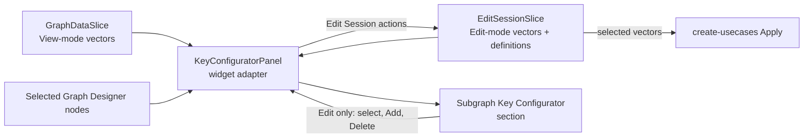

# Subgraph Key Configurator: Low-Level Design

**Status:** Draft

**Requirements:** [requirements.md](requirements.md)

## 1. Scope

**1.1 Feature boundary.** The Subgraph Key Configurator provides store-backed
display and editing of the KV vectors associated with graph subgraphs. It
integrates with the Key Configurator host, Graph Designer store, graph-key
definitions, project preferences, and create-usecases Apply flow.

The following remain outside this design:

1. backend implementation and direct backend writes for individual actions;
2. graph topology ownership and the external policy/data contracts used for
  usecase routing and EC classification;
3. changes to Graph Designer Apply, Discard, and graph-removal operations; and
4. changes to non-subgraph configurators and generic Key Configurator stacking
   or collapse behavior.

## 2. Architecture

### 2.1 Overview

**2.1.1 State ownership.** `GraphDataSlice` owns the read-only KV-vector
snapshot as part of each `Subgraph`. `EditSessionSlice`, composed into
`GraphDesignerStore`, owns the editable copy for an active edit session.



Read the diagram left to right:

1. **2.1.2** The adapter reads Graph Data in View mode or Edit Session in Edit
   mode.
2. **2.1.3** Graph Designer selection identifies which selected items require a
   Subgraph Key Configurator section.
3. **2.1.4** In Edit mode, panel changes return through the adapter and update
   Edit Session state.
4. **2.1.5** Apply serializes selected Edit Session vectors; it does not read
   the panel or Graph Data.

**2.1.6 Feature boundary.** The Key Configurator reads Graph Data in View mode
and the Edit Session copy in Edit mode. The widget layer adapts Graph Designer
state to Key Configurator props without feature-to-feature imports.

### 2.2 FSD ownership

| Ref | Area | Responsibility |
| --- | --- | --- |
| 2.2.1 | `entities/subgraph-definitions` | SGKV transport DTO, query API, and shared KV-vector types. |
| 2.2.2 | `entities/key-definitions` | Available graph-key types and definition mapping. |
| 2.2.3 | `features/graph-designer/model` | Read-only vectors, editable session vectors, mutations, and Apply-facing state. |
| 2.2.4 | `features/graph-designer/lib` | Pure vector mapping and identity helpers. |
| 2.2.5 | `features/key-configurator/subgraph-configurator-view` | Vector UI, filtering, formatting, and Add interaction. |
| 2.2.6 | `widgets/key-configurator-panel` | Adapts Graph Designer selection and SGKV actions to the configurator. |

**2.2.7 Feature import rule.** The Key Configurator feature shall not import
Graph Designer.

**2.2.8 Assigned-vector ownership.** Assigned KV-vector state is not owned by
a Key Configurator store. It is read from Graph Data in View mode and from Edit
Session in Edit mode.

## 3. Store design

**Files:**

- `packages/react-app/src/entities/subgraph-definitions/model/subgraph-kv.types.ts`
- `packages/react-app/src/entities/key-definitions/model/available-graph-key.types.ts`
- `packages/react-app/src/features/graph-designer/model/edit-session-slice.ts`
- `packages/react-app/src/features/graph-designer/model/graph-data-slice.ts`

**3.0.1 Shared SGKV types.** Shared SGKV types are owned by the entity layer so
Graph Designer and Key Configurator can consume them without feature-to-feature
imports. `isSessionAdded` is meaningful only in Edit Session state.

```ts
interface KvSelection {
  isEc: boolean;
  isSessionAdded?: boolean;
  keyValuePairs: KeyValue[];
  selected: boolean;
  systemId: string;
}

interface KvSelectionMetadata {
  isEc: boolean;
  selected: boolean;
}

```

**3.0.2 Graph Data Slice.** `GraphDataSlice.Subgraph` owns the View-mode
vector snapshot. It updates derived View-mode metadata without changing vector
pairs or identity.

```ts
interface Subgraph {
  // other subgraph fields
  kvVectors: KvSelection[];
}

interface GraphDataSlice {
  updateSgKvMetadata: (
    metadataBySubgraphId: Record<
      string,
      Record<string, KvSelectionMetadata>
    >,
  ) => void;
}
```

**3.0.3 Edit Session Slice.** `EditSessionSlice` owns the editable vector map,
the Edit-only definition cache, and all user mutations.

```ts
interface EditSessionSlice {
  availableGraphKeys: AvailableGraphKeyCollection | null;
  kvSelectionsById: Record<string, KvSelection[]>;

  addSgKvVector: (
    subgraphSystemId: string,
    keyValuePairs: KeyValue[],
  ) => boolean;
  deleteSgKvVector: (
    subgraphSystemId: string,
    vectorSystemId: string,
  ) => void;
  updateSgKvConfigInfo: (
    vectorsBySubgraphId: Record<string, KvSelection[]>,
  ) => void;
  setSgKvVectorSelected: (
    subgraphSystemId: string,
    vectorSystemId: string,
    selected: boolean,
  ) => void;
}
```

**3.0.4 Available-definition contract.** `AvailableGraphKeyCollection` is an
ordered array. It preserves backend definition order for the Add controls and
retains the canonical IDs required for selection and Apply mapping.

```ts
type AvailableGraphKeyCollection = AvailableGraphKey[];

interface AvailableGraphKey {
  id: number;
  name: string;
  systemId: string;
  values: AvailableGraphValue[];
}

interface AvailableGraphValue {
  id: number;
  name: string;
  systemId: string;
}
```

The widget passes this collection to the Add controls as read-only data.

### 3.1 State rules

**3.1.1** Map keys are subgraph system IDs, matching `graphData.subgraphs` and
Apply.

**3.1.2** Each array item is one complete KV vector.

**3.1.3** Transport vectors retain their SGKV system ID.

**3.1.4** A session-added vector receives a deterministic local ID derived from its
  canonical pair signature and prefixed with `local:`.

**3.1.5** Key/value pairs follow graph-key definition order for display.

**3.1.6** Vector equality is order-independent and compares
  `keySystemId:valueSystemId` pairs.

**3.1.7** `isEc` is metadata derived and updated by Key Configurator. Users
cannot edit it, and Apply does not send it.

**3.1.8** `isSessionAdded` exists only on the edit-session copy and is not sent by
  Apply.

**3.1.9** `availableGraphKeys` is populated only for an active Edit session.

**3.1.10** Components shall use store actions rather than raw Zustand `setState`.

### 3.2 Actions

**Graph Data Slice**

| Ref | Action | Effect |
| --- | --- | --- |
| 3.2.1 | Update Graph Data metadata | Replaces only `selected` and `isEc` for matching Graph Data vectors. It ignores unknown subgraphs/vectors and does not mark the graph dirty. |

**Edit Session Slice**

| Ref | Action | Effect |
| --- | --- | --- |
| 3.2.2 | Update SGKV config info | Receives a complete vector map from Graph Data reconciliation or Edit-mode metadata calculation. It adds missing active subgraph entries with `isSessionAdded: false`, removes inactive subgraph entries, preserves session-only vectors, and applies incoming `selected`/`isEc` metadata to vectors with matching system IDs. It does not mark the graph dirty. |
| 3.2.3 | Select/unselect | Updates only one vector's `selected` field and marks the graph dirty when its value changes. |
| 3.2.4 | Add | Rejects incomplete or duplicate vectors, creates a local ID, inserts a selected session-added vector with `isEc: false`, marks the graph dirty, and returns whether it accepted the candidate. A later completed Graph Data refresh recalculates EC classification. |
| 3.2.5 | Delete | Removes only a vector whose stored `isSessionAdded` value is true and marks the graph dirty. |

**3.2.6 Mutation boundary.** Mutation actions validate the target subgraph and
vector inside the store. UI visibility is not treated as an authorization
boundary.

## 4. Data population and lifecycle

### 4.1 SGKV transport mapping

**File:**
`packages/react-app/src/entities/subgraph-definitions/model/subgraph-response.dto.ts`

**4.1.1 Transport contract.** The API mapper shall represent the Swagger
`SubgraphResponseDto.SGKV` contract as a list of vectors:

```ts
interface KeyValuePairDto {
  key: {
    keyId: number;
    name: string;
    systemId: string;
  };
  value: {
    name: string;
    systemId: string;
    valueId: number;
  };
}

interface SubgraphKvVectorDto {
  keyValuePairs: KeyValuePairDto[];
  systemId: string;
}

interface SubgraphResponseDto {
  // scalar fields
  SGKV: SubgraphKvVectorDto[];
}
```

### 4.2 Graph-data population

**Files:**

- `packages/react-app/src/entities/subgraph-definitions/api/subgraph-definition-api.ts`
- `packages/react-app/src/features/graph-designer/model/graph-data-slice.ts`
- `packages/react-app/src/features/graph-designer/lib/subgraph-kv-mapping.ts`

**4.2.1 Full graph load.** On every full graph load, `loadGraphData` calls
`getSubgraphDetailsByIds` for all active subgraphs. The response includes SGKV
data. The mapper converts each response vector into `KvSelection`, and the
Graph Data slice replaces each matching `Subgraph.kvVectors` alongside the
subgraph name and type.

**4.2.2 Selection-time behavior.** Selecting a subgraph shall not issue
another SGKV request. A usecase change or successful Apply/Discard reload
replaces the read-only graph snapshot with the new backend response.

**4.2.3 Edit-mode handoff.** When `ProjectStore.editModeState` is `edit`,
`GraphDataSlice.loadGraphData` derives
`Record<subgraphSystemId, KvSelection[]>` from that refreshed snapshot and
passes it to `EditSessionSlice.updateSgKvConfigInfo()`. In View mode, it does
not update Edit Session state.

**4.2.4 Recompute handoff.** `recomputeContainersAndSubgraphs` preserves
`kvVectors` for surviving subgraphs and follows the same mapping path for newly
derived subgraphs before replacing the Graph Data snapshot. If an Edit session
is active, it then passes the complete resulting vector map to
`updateSgKvConfigInfo()`.

**4.2.5 Empty-graph handoff.** `initializeEmptyGraphData` replaces Graph Data
with an empty snapshot. If an Edit session is active, it passes an empty vector
map to `updateSgKvConfigInfo()`.

### 4.3 Edit entry

**4.3.1 Entry sequence.**
`packages/react-app/src/features/graph-designer/model/edit-session-slice.ts`
performs these steps in order:

1. acquire the Graph Designer exclusive-mode lock;
2. end the active project session and start a Designer session;
3. load graph-key definitions, treating failure as non-fatal;
4. call `updateSgKvConfigInfo()` with all
   `graphData.subgraphs[*].kvVectors`, preserving `systemId`, `keyValuePairs`,
   `selected`, and `isEc`, while setting `isSessionAdded` to `false`; and
5. set Edit Session mode and `ProjectStore.editModeState` to `edit`.

If session transition fails, the method releases the exclusive-mode lock and
does not modify SGKV state or enter Edit mode.

**4.3.2 Edit source.** The Key Configurator reads this editable copy for the
remainder of Edit mode.

**4.3.3 Reconciliation rule.** Whenever a Graph Data update changes its
subgraphs during Edit mode, the same action reconciles only the session map: it
adds vectors for active subgraphs missing from the map and removes entries for
inactive subgraphs. It preserves the existing KV pairs and `isSessionAdded`
state. The metadata calculation for the completed Graph Data snapshot then
replaces `selected` and `isEc`.

### 4.4 Apply, Discard, and Edit exit

**4.4.1 Apply, Discard, and exit.** Apply and Discard submit or discard
edit-session state, reload Graph Data, and only then exit Edit mode. The reload
refreshes `Subgraph.kvVectors` from the backend. `exitEditMode` clears the
editable map and `availableGraphKeys`; it does not copy data back to Graph
Data. If reload fails, Edit mode remains active with its session state.

### 4.5 Graph-key definitions

**Files:**

- `packages/react-app/src/entities/key-definitions/api/key-definition-api.ts`
- `packages/react-app/src/entities/key-definitions/model/available-graph-key.types.ts`
- `packages/react-app/src/entities/key-definitions/model/key-definition.mapper.ts`
- `packages/react-app/src/features/graph-designer/model/edit-session-slice.ts`

**4.5.1 Definition load.** During Edit entry, `getAllKeyDefinitions(projectId)`
loads project definitions. The entity mapper retains only definitions whose
`isGraphKey` value is true and maps them, in response order, into
`AvailableGraphKeyCollection`.

```text
EditSessionSlice.enterEditMode
  └─ getAllKeyDefinitions(projectId)
       └─ EditSessionSlice.availableGraphKeys
```

A definition-load failure leaves `availableGraphKeys` as `null` and does not
prevent Edit mode. The Add section remains unavailable.

**4.5.2 Definition consumer.** `SubgraphKeyVectorConfigPanel` receives
`availableGraphKeys` through the widget adapter for the Add controls.

### 4.6 Apply and View mode

**4.6.1** View mode reads
`GraphDataSlice.graphData.subgraphs[*].kvVectors`.

**4.6.2** Apply reads `EditSessionSlice.kvSelectionsById`.

**4.6.3** `buildCreateUsecasesRequest` sends only selected vectors and their value
  system IDs.

**4.6.4** Leaving Edit mode clears only the editable vector map.

**4.6.5** Closing the project destroys its Graph Designer tab store.

## 5. UI design

### 5.1 Mode and data source

**5.1.1 Mode switch.** `KeyConfiguratorPanel` reads
`ProjectStore.editModeState` to select the subgraph-vector source:

| Ref | Project mode | Vector source | Mutability |
| --- | --- | --- | --- |
| 5.1.2 | View | `GraphDataSlice.graphData.subgraphs[subgraphSystemId].kvVectors` | Read-only |
| 5.1.3 | Edit | `EditSessionSlice.kvSelectionsById[subgraphSystemId]` | Editable |

**5.1.4 Widget adapter.** The widget reads Graph Designer state and passes
vectors plus mutation callbacks to the feature panel. On Add, Delete, or
selection change, its callback invokes the corresponding Edit Session action.
The feature panel does not import Graph Designer or Project Store code.

### 5.2 Selection integration

**5.2.1 Selection mapping.** Graph Designer owns selection.
`KeyConfiguratorPanel` maps selected `SUBGRAPH` and `SUBGRAPH_PROXY` nodes into
the Key Configurator `ConfigurationItem` contract.

**5.2.2 Host composition.** `ConfiguratorPanel` renders stacked, independently
collapsible sections. The Subgraph Key Configurator supplies the content for
subgraph sections.

### 5.3 Subgraph panel contract

**5.3.1 Panel contract.** `SubgraphKeyVectorConfigPanel` receives canonical
vector state and mutation callbacks from the widget:

```ts
type EcFilter = 'ec' | 'non-ec';
type VectorSelectionFilter = 'all' | 'selected' | 'unselected';

interface SubgraphKvFilterState {
  ecFilter: EcFilter;
  searchText: string;
  selectionFilter: VectorSelectionFilter;
}

interface SubgraphKeyVectorConfigPanelProps {
  displayMode: 'key-value' | 'value-only';
  filters: SubgraphKvFilterState;
  isEditable: boolean;
  availableGraphKeys: AvailableGraphKeyCollection | null;
  onAdd: (keyValuePairs: KeyValue[]) => boolean;
  onDelete: (vectorSystemId: string) => void;
  onFiltersChange: (filters: SubgraphKvFilterState) => void;
  onSelectionChange: (
    vectorSystemId: string,
    selected: boolean,
  ) => void;
  subgraphSystemId: string;
  vectors: KvSelection[];
}
```

**5.3.2 Shared filter state.** The widget creates one filter-state instance for
the Key Configurator session and passes it to every rendered subgraph panel. It
defaults to empty search, `selected`, and `non-ec`; it survives subgraph
selection and mode changes, and resets when the project session closes.

**5.3.3 Panel isolation.** The component does not import Graph Designer. Vector
data, mutations, shared filter state, and the Edit-session graph-key cache
remain controlled through props. Delete is shown only when `isEditable` and the
vector's `isSessionAdded` value are both true.

### 5.4 Component structure

```text
SubgraphKeyVectorConfigPanel
├── Vector toolbar
│   ├── Search
│   ├── Selected / Unselected / All filter
│   └── EC two-state filter
├── KV vector list
│   └── KV vector row
│       ├── Selection checkbox
│       ├── Formatted vector text
│       ├── Copy
│       └── Delete (session-added only)
└── Add KV Vector section (Edit mode only)
    ├── Add KV Vector Editor
    ├── Add KV Vector Selection Panel
    └── Add
```

**5.4.1 Panel composition.** The structure above is the complete panel layout.

**5.4.2 Control convention.** QUI controls are used where equivalents exist.
Delete uses a QUI confirmation dialog rather than `window.confirm`.

### 5.5 KV Vector List

**5.5.1 Canonical list.** The store-provided vector array is canonical; the
list never copies or sorts it in place. A pure `getVisibleKvVectors` helper
derives the visible projection:

1. **5.5.2** Split `searchText` on `+`, trim it, and discard empty terms.
2. **5.5.3** Match every term case-insensitively against a vector's complete
   `[Key:Value]` search representation, independently of display mode.
3. **5.5.4** Keep either EC or non-EC vectors according to `ecFilter`.
4. **5.5.5** Keep `Selected`, `Unselected`, or `All` vectors according to
   `selectionFilter`.
5. **5.5.6** In `All`, stably place selected vectors before unselected vectors.

**5.5.7 Mutation scope.** The toolbar updates only shared browsing state. Row
selection, Add, and Delete update only the selected subgraph's vector store
entry. The filtered projection is recomputed whenever its vectors, metadata, or
filters change.

**5.5.8 Empty states.** The list distinguishes two empty states: no canonical
vectors uses the vector empty state; a non-empty canonical list with no
projection match uses a no-matches state.

**5.5.9 Row behavior.** Each compact row has a fixed leading selection
checkbox, single-line truncated vector text with a full-text tooltip, and
trailing icon actions. An EC vector has a small visual EC indicator. Copy is
always present; Delete is present only in Edit mode for a session-added vector.
The list scrolls vertically and does not require horizontal scrolling.

### 5.6 Display and Copy

**5.6.1 Display representations.** The list uses distinct pure representations:

```text
Search:          [DeviceTX:A2B_Mic][StreamTX:PCM_ULL_Record]
Key Value row:   [DeviceTX:A2B_Mic][StreamTX:PCM_ULL_Record]
Value Only row:  A2B_Mic+PCM_ULL_Record
Copy:            follows the active row display format
```

**5.6.2 Preference mapping.** `Key Value(s)` in the `Usecase Name` display
preference selects Key Value mode; `Alias` and `Value(s)` select Value Only
mode. Preference changes reformat the visible rows without changing stored
vectors, filter results, or candidate selection.

**5.6.3 Copy behavior.** Copy writes the complete formatted vector through a
shared renderer clipboard helper. A clipboard failure is logged and leaves
vector and candidate state unchanged.

### 5.7 Read-only and Edit modes

**5.7.1 View mode.** View mode keeps search, filters, scrolling, and Copy
enabled. It disables row selection, hides the Add section and Delete actions,
and does not mutate state.

**5.7.2 Edit mode.** Edit mode enables selection changes and Add. Delete is
visible only when the stored vector has `isSessionAdded: true`; the store action
verifies eligibility again before deletion. Delete first opens a confirmation
dialog; dismissal makes no store change.

**5.7.3 Persistence boundary.** There are no configurator-level Apply or
Cancel actions. Accepted selection, Add, and Delete operations update the
store immediately. Graph Designer Apply remains the persistence boundary.

## 6. Add KV Vector design

**6.0.1 Local draft boundary.** The Add section is local component state. It
constructs one candidate for one subgraph and never mutates the vector store
until Add succeeds.

```ts
interface AddKvVectorState {
  draft: AddKvVectorDraft;
  isOpen: boolean;
}

interface AddKvVectorDraft {
  editorText: string;
  selectedKeySystemIds: string[];
  selectedValueSystemIdByKeySystemId: Record<string, string>;
  validation: AddKvEditorValidation;
  suggestions: AddKvSuggestionState | null;
}

interface AddKvSuggestionState {
  activeIndex: number | null;
  items: AddKvSuggestion[];
  replacementRange: {end: number; start: number};
}

interface AddKvSuggestion {
  keySystemId: string;
  kind: 'key' | 'value';
  label: string;
  valueSystemId?: string;
}
```

**6.0.2 Draft invariant.** `selectedKeySystemIds` preserves an explicitly
selected key before it has a value. `selectedValueSystemIdByKeySystemId`
contains at most one value for each selected key. Together they are the last
valid candidate selection. Invalid editor text changes only `editorText`,
`validation`, and suggestions; it never partially changes this selection.

**6.0.3 Draft identity.** Selected key IDs are unique, and every value-map key
must be a selected key. Suggestions carry key and value system IDs so duplicate
labels cannot create ambiguous stored state.

### 6.1 Add controls and Selection Panel

**6.1.1** The Add section is available only in Edit mode after `availableGraphKeys` is
  ready. Opening it creates an empty draft; opening is otherwise disabled and
  does not alter the vector list or an already-open draft.

**6.1.2** `AddKvVectorSelectionPanel` presents the available keys as a compact,
  expandable tree. Key and value filters are case-insensitive; a matching value
  reveals its owning key. Users can expand/collapse all filtered keys, sort keys
  and values by identifier or name, and select/deselect all filtered keys.

**6.1.3** Selecting a value selects its key. A key permits one value selection. Clearing
  a key removes its selected value. Sorting and filtering change only the
  projection, never the draft.

**6.1.4** Manual panel changes derive complete pairs from selected keys with values,
  ordered by graph-key definition order. They replace `editorText` using the
  active display mode and clear validation/suggestions. Selected keys without a
  value remain selected in the panel but do not appear in editor text.

**6.1.5** The editor, suggestion popup, key list, and value lists wrap or scroll
  vertically as needed and do not require horizontal scrolling for normal use.

### 6.2 Editor parsing, resolution, and formatting

**6.2.1 Accepted formats.** The editor accepts three representations:

```text
Key Value:       [DeviceTX:A2B_Mic][StreamTX:PCM_ULL_Record]
Value Only:      A2B_Mic+PCM_ULL_Record
Mixed:           [DeviceTX:A2B_Mic]PCM_ULL_Record
```

**6.2.2 Parser rules.** `parseKvVectorEditorText` first identifies the syntax
and tokens. It rejects multiline input, malformed or incomplete bracket pairs,
invalid names, duplicate keys, empty Value Only tokens, and Value Only input
when a definition contains `+`. Whitespace-only text is a valid empty candidate.

**6.2.3 Resolver rules.** `resolveKvVectorEditorInput` resolves parsed names
case-insensitively against `availableGraphKeys`. A Key Value pair must resolve
to that key and one of its values. Value Only and mixed suffix values must
resolve to a single assignment across distinct unused keys; zero or multiple
assignments are invalid. A valid trailing `+` preserves the resolved prefix for
continued entry.

**6.2.4 Atomic resolution.** Resolution is atomic:

1. valid input replaces the selected key/value IDs, clears validation, and is
  formatted canonically in the active display mode;
2. empty input clears selected keys and values; and
3. invalid or ambiguous input stays visible with validation feedback while the
  last valid Selection Panel state remains unchanged.

**6.2.5 Display-mode transition.** Changing display mode reformats a valid
editor value from selected IDs without changing the candidate. Formatting
follows graph-key definition order. When Value Only syntax is unavailable
because a definition name contains `+`, the editor remains in Key Value syntax.

### 6.3 Suggestions and keyboard interaction

**6.3.1 Suggestion input.** `getKvVectorEditorSuggestions` receives editor
text, caret position, parsed prefix, and definitions. It returns suggestions
plus the exact replacement range for the token at the caret.

**6.3.2** Key positions suggest matching unused keys. Value positions suggest values of
  the resolved key. Value Only and mixed suffix positions suggest values with
  their owning key and exclude already-used keys.

**6.3.3** Suggestions are case-insensitive, sorted, capped at 50, and have no initial
  active item. Invalid multiline input or an invalid preceding expression has
  no suggestions.

**6.3.4** Up/Down moves an explicit active item without wrapping. Enter or a pointer
  action commits only that item. Escape closes and consumes the key; Tab and
  editor focus loss close the popup while preserving normal focus behavior.

**6.3.5** `applyKvVectorEditorSuggestion` replaces only `replacementRange`, supplying
  or completing Key Value syntax as needed. A Value Only suggestion committed
  at the end of Value Only text appends `+` for continued entry. The resulting
  text is resolved through the same atomic editor path.

### 6.4 Add eligibility and outcome

**6.4.1 Add eligibility.** `getAddKvVectorEligibility` derives eligibility from
the local draft and the canonical vector list. Add is enabled only when the
editor is valid, at least one complete pair exists, every selected key has one
value, and its order-independent pair signature is absent from that subgraph.

**6.4.2 Add outcome.** On Add, `SubgraphKeyVectorConfigPanel` passes resolved
pairs to its widget callback. The widget invokes `addSgKvVector`; the store
rechecks completeness and duplication, then inserts a selected session-added
vector and marks the graph dirty. The component clears and closes the Add
section only after that callback accepts the candidate. Rejection leaves the
draft open and unchanged. There are no local Apply or Cancel buttons.

## 7. Selected and EC metadata synchronization

**7.1 Metadata trigger.** Each stored vector carries `selected` and `isEc`
metadata required by the UI. The Key Configurator owns their calculation. A
widget-level synchronization effect runs only when a complete Graph Data
snapshot is committed or the project enters Edit mode. Its dependencies are
`graphDataStatus`, `graphData.selectedUsecases`, `graphData.subgraphs`, and the
project edit mode. In Edit mode, the effect reads the latest
`EditSessionSlice.kvSelectionsById` and
`EditSessionSlice.subgraphProvenanceById` through the project store without
subscribing to them. Therefore, user-originated selection, Add, and Delete
mutations do not trigger automatic recalculation.

**7.2 Auto-selection.** Auto-selection processes each subgraph that belongs to
a usecase. In Edit mode, a subgraph whose `subgraphProvenanceById` value is
`palette-placed` is excluded. For every remaining subgraph:

1. **7.2.1** Resolve the selected usecases that contain that subgraph.
2. **7.2.2** For each KV vector, mark it selected when its complete KV-pair set is a
   subset of at least one of those usecases' KV data for that same subgraph;
   otherwise mark it unselected.

**7.3 Calculation helper.** `calculateSubgraphKvMetadata` is a pure Key
Configurator helper. It receives the completed Graph Data snapshot, the target
vector map, and Edit-mode provenance when applicable. It returns:

```ts
Record<subgraphSystemId, Record<vectorSystemId, KvSelectionMetadata>>
```

**7.4 Metadata write.** In View mode, the target map is Graph Data and the
widget dispatches `GraphDataSlice.updateSgKvMetadata`. In Edit mode, the target
map is the Edit Session map. The widget overlays the returned metadata onto
that complete map and dispatches `EditSessionSlice.updateSgKvConfigInfo`. A
completed Graph Data refresh is authoritative: after reconciliation, the effect
recalculates and replaces `selected` and `isEc`, including staged Edit Session
metadata. The update is idempotent and does not write when metadata is
unchanged.

**7.5 Widget boundary.** The widget passes explicit inputs to the pure helper
and owns source selection and writes. The Key Configurator feature does not
import Graph Designer state.

## 8. Error and concurrency handling

**8.1** A Graph Data request is authoritative only after it commits a complete
snapshot and reaches its ready state. Metadata synchronization observes that
committed snapshot, never an in-progress request. Its pure calculation is
synchronous, idempotent, and writes only when metadata differs, preventing a
source-update loop.

**8.2** A later completed Graph Data snapshot supersedes an earlier one. The widget
derives metadata from the same snapshot reference it observed and ignores it
if that reference is no longer the latest committed snapshot before writing.

**8.3** Definition loading is independent of vector display. Until definitions are
ready, View-mode browsing remains available and the Add section is disabled. A
definition-load failure leaves stored vectors and any open draft intact.

**8.4** Parsing, resolving, filtering, formatting, duplicate checks, and suggestion
generation are pure local operations. Invalid, ambiguous, incomplete, or
duplicate input leaves store state unchanged.

**8.5** Selection, Add, and Delete are synchronous per-subgraph mutations. The store
validates the target again; an accepted mutation calls `markDirty()` once.
Delete confirmation dismissal and clipboard failure cause no state mutation.

**8.6** Clipboard writes are caught and logged by the shared renderer utility. Store
state contains only serializable arrays and records.

## 9. Source organization

| Ref | Source area | Design responsibility |
| --- | --- | --- |
| 9.1 | `entities/subgraph-definitions/model/subgraph-response.dto.ts` | SGKV transport shape. |
| 9.2 | `entities/subgraph-definitions/model/subgraph-kv.types.ts` | Shared `KvSelection` and metadata contracts. |
| 9.3 | `entities/subgraph-definitions/api/subgraph-definition-api.ts` | `getSubgraphDetailsByIds` query. |
| 9.4 | `entities/key-definitions/model/available-graph-key.types.ts` | Shared Add-control definition contracts. |
| 9.5 | `entities/key-definitions/model/key-definition.mapper.ts` | Graph-key filtering and ordered definition mapping. |
| 9.6 | `features/graph-designer/model/edit-session-slice.ts` | Editable vector state, graph-key cache, palette-placement provenance, and actions. |
| 9.7 | `features/graph-designer/model/graph-designer-store.ts` | `EditSessionSlice` composition. |
| 9.8 | `features/graph-designer/model/graph-data-slice.ts` | Read-only subgraph vectors, metadata updates, and Edit-mode reconciliation handoff. |
| 9.9 | `features/graph-designer/lib/subgraph-kv-mapping.ts` | DTO mapping and vector identity helpers. |
| 9.10 | `features/graph-designer/lib/build-create-usecases-request.ts` | Selected-vector serialization for Apply. |
| 9.11 | `features/key-configurator/subgraph-configurator-view/lib/kv-vector-format.ts` | Canonical KV-pair ordering plus list and editor formatting. |
| 9.12 | `features/key-configurator/subgraph-configurator-view/lib/kv-vector-filter.ts` | Pure visible-list projection. |
| 9.13 | `features/key-configurator/subgraph-configurator-view/lib/add-kv-vector-editor.ts` | Parser, resolver, validation, suggestions, replacement, and Add eligibility. |
| 9.14 | `features/key-configurator/subgraph-configurator-view/ui/` | Vector list/row, Add Editor, Selection Panel, confirmation, and local draft orchestration. |
| 9.15 | `widgets/key-configurator-panel/` | Project-mode source switch, Graph Data metadata synchronization, Edit Session provenance adapter, and SGKV store adapter. |

**9.16 Source boundary.** Electron and backend source are outside this design.

## 10. Test plan

### 10.1 Shared fixtures and boundaries

Test factories shall provide:

1. **10.1.1** Persisted selected and unselected vectors, including EC and
   non-EC vectors.
2. **10.1.2** A session-added vector and a second subgraph, to prove mutations remain
  scoped to their target;
3. **10.1.3** Graph-key definitions with duplicate-looking labels, ambiguous
   values, and a `+` name.
4. **10.1.4** View and Edit Graph Data snapshots, including palette-placed
   provenance.

**10.1.5 Test boundary.** Unit and component tests shall use these factories.
Widget integration tests shall mock the entity API response. Backend behavior
and Electron shell behavior are outside this test plan.

**10.1.6 Test convention.** Every React suite shall mock
`~shared/lib/logger`. QUI component mocks shall remove non-DOM props before
rendering native test elements.

**10.1.7 Contract dependency.** The auto-selection and EC test cases shall use
explicit catalog and subgraph-membership inputs to the pure helper. Their
production adapter tests remain pending until the open data-contract questions
in Section 12 are resolved.

### 10.2 Test suite ownership

| Ref | Test file | Responsibility |
| --- | --- | --- |
| 10.2.1 | `tests/features/graph-designer/lib/subgraph-kv-mapping.test.ts` | SGKV mapping, vector identity, and transport IDs. |
| 10.2.2 | `tests/features/graph-designer/model/edit-session-slice.test.ts` | Reconciliation and Edit-mode mutations. |
| 10.2.3 | `tests/features/graph-designer/model/graph-data-slice.test.ts` | Full-load, recompute, and empty-graph population handoff. |
| 10.2.4 | `tests/features/graph-designer/lib/build-create-usecases-request.test.ts` | Extend selected-vector Apply serialization coverage. |
| 10.2.5 | `tests/features/key-configurator/subgraph-configurator-view/lib/*.test.ts` | Formatting, filtering, editor parsing, resolution, suggestions, and Add eligibility. |
| 10.2.6 | `tests/features/key-configurator/subgraph-configurator-view/ui/subgraph-key-vector-config-panel.test.tsx` | Prop-driven vector-list and Add-control behavior. |
| 10.2.7 | `tests/widgets/key-configurator-panel/ui/key-configurator-panel.test.tsx` | Mode source switch, Designer selection bridge, metadata synchronization, and multi-panel composition. |

### 10.3 Pure unit tests

1. **10.3.1** Transport DTO mapping.
2. **10.3.2** Vector signatures and order-independent duplicate detection.
3. **10.3.3** Display and Copy formatting.
4. **10.3.4** Search, selection filter, EC filter, and selected-first ordering.
5. **10.3.5** Parser handling for empty, Key Value, Value Only, mixed, multiline,
  malformed, duplicate-key, and trailing-`+` input;
6. **10.3.6** Resolver handling for case-insensitive matches, unknown values, unavailable
  definitions, `+` in definitions, no distinct-key assignment, and ambiguity;
7. **10.3.7** Atomic valid/invalid draft transitions and definition-order formatting.
8. **10.3.8** Suggestion context, replacement ranges, 50-item cap, keyboard boundaries,
  and continuation delimiter behavior;
9. **10.3.9** Add eligibility, including incomplete, invalid, and duplicate candidates.
10. **10.3.10** Auto-selection and EC calculation with explicit catalog and subgraph
  membership inputs.

### 10.4 Store tests

1. **10.4.1** `updateSgKvConfigInfo` retains staged entries, seeds missing active entries,
  removes inactive entries, marks copied vectors as not session-added, and
  replaces only refresh-derived `selected` and `isEc` metadata;
2. **10.4.2** Full graph loads, subgraph recomputation, and empty-graph initialization
  each hand off the complete current vector map for Edit-mode reconciliation;
3. **10.4.3** Graph-key definitions load once at Edit entry and clear on exit.
4. **10.4.4** Selection, Add, and Delete affect only the target subgraph.
5. **10.4.5** Add creates a selected, non-EC, session-added vector.
6. **10.4.6** Delete rejects vectors not marked session-added.
7. **10.4.7** Accepted mutations mark Graph Designer dirty.
8. **10.4.8** View/Edit transitions copy Graph Data into Edit Session and clear only the
  editable copy on exit; and
9. **10.4.9** Metadata writes are idempotent and target Graph Data in View mode or Edit
  Session in Edit mode.

### 10.5 Component tests

1. **10.5.1** Empty, read-only, and editable rendering.
2. **10.5.2** Display preference changes.
3. **10.5.3** Combined search, selection, and EC filters.
4. **10.5.4** Row selection and conditional Delete confirmation.
5. **10.5.5** Copy output in both formats.
6. **10.5.6** Add eligibility and duplicate rejection.
7. **10.5.7** Editor and Selection Panel synchronization in both directions.
8. **10.5.8** Selected keys without values, editor validation retention, and Add success or
  rejection outcomes;
9. **10.5.9** Truncated vector text with the full-vector tooltip.
10. **10.5.10** Keyboard interaction for search, suggestions, and dialogs.
11. **10.5.11** Definition-unavailable, clipboard-failure, empty-list, and no-match states.

### 10.6 Widget and integration tests

1. **10.6.1** Subgraph and proxy selection display the correct sections.
2. **10.6.2** Multiple selected items remain independently collapsible.
3. **10.6.3** Project Store mode selects the correct Graph Data or Edit Session vectors.
4. **10.6.4** Graph loads populate read-only vectors without a selection-time request.
5. **10.6.5** Completed Graph Data refresh recalculates and overwrites vector `selected`
  and `isEc` metadata in the active View or Edit source;
6. **10.6.6** Apply receives only selected vectors from the canonical store.
7. **10.6.7** Mock SGKV responses matching the Swagger contract populate the
   expected vector rows.

### 10.7 Execution sequence

**10.7.1** Tests shall be added in this order: pure mapping/editor helpers,
Graph Designer store actions, feature components, then widget/mock integration.
Each new store or widget behavior shall have a regression test before its
implementation is considered complete.

## 11. Requirements traceability

| Requirements | Design sections |
| --- | --- |
| FR-SGKV-01, FR-SGKV-02 | 2–4 |
| FR-SGKV-03 | 5.2 |
| FR-SGKV-04, FR-SGKV-05, FR-SGKV-06 | 5.3–5.5 |
| FR-SGKV-07 through FR-SGKV-10 | 5.6 |
| FR-SGKV-11 through FR-SGKV-14 | 5.5 |
| FR-SGKV-15 through FR-SGKV-20 | 3.2, 5.7, 6.4 |
| FR-SGKV-21 through FR-SGKV-29 | 6.1 |
| FR-SGKV-30 through FR-SGKV-42 | 6.2 |
| FR-SGKV-43 through FR-SGKV-50 | 6.3 |
| FR-SGKV-51 through FR-SGKV-54 | 6.4 |
| FR-SGKV-55, FR-SGKV-56 | 5.6, 8 |
| FR-SGKV-57 through FR-SGKV-61 | 5.3, 5.5 |
| FR-SGKV-62 through FR-SGKV-65 | 5.4, 5.7, 6.1, 6.4, 8 |
| FR-SGKV-66 | 5.6, 8 |
| FR-SGKV-67 through FR-SGKV-69 | 4.2, 4.3, 7, 8 |

## 12. Open questions

**12.1** Which project-scoped source shall provide the complete usecase catalog
required for `isEc` derivation?

**12.2** Which data contract shall provide each subgraph's containing usecases
and each containing usecase's SGKV data for the auto-selection rule in Section
7?
